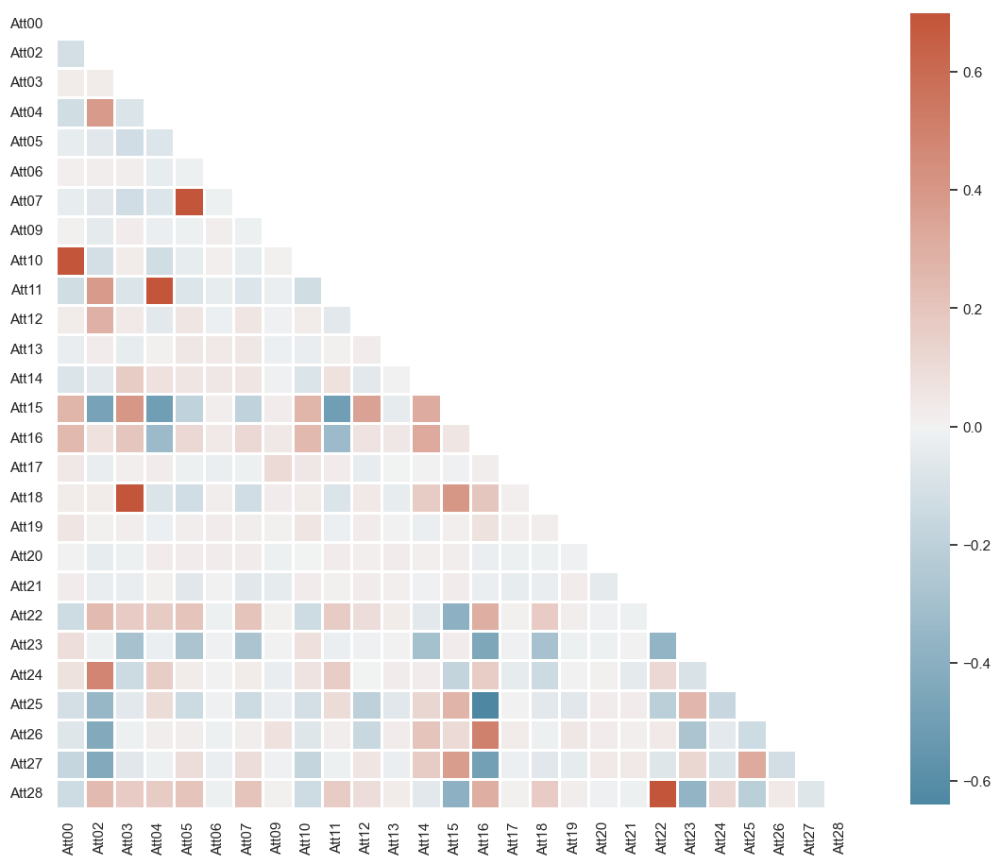
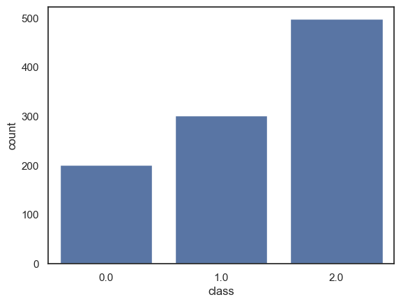

# Introduction

Predictive analytics is undertaken on the data provided after undertaking a series of data understanding, pre-processing and model selection. Data understanding is undertaken under data preparation to get a clear picture with regard to statistical data summaries, missing entries in the data, duplicate row data. The imperfections noted are handled through the pre-processing of the data and put in consideration in the assessment of variables viable for predictive task. The main predictive task to be undertaken is classification, with the dependent variable a multi-label. Three classification models, the k-NN, Naïve Bayes, and the Decision Trees are used to train the data, fine-tuned to attain the best parameters to attain models better suited at prediction tasks on the train data. The two best models based on their performances are used to predict the test data provided. All steps are backed by concrete explanations with regard to the choice.


```python

```

# Methodology


```python

```

The data preparation section handles the identifying and removal of irrelevant attributes, detecting and handling of missing entries, duplicates in the instances and attributes, the selection of suitable data types for attributes and data transformation whenever required.


```python

```

## Data

### Data Description

The data stored within a SQLite file is imported into the workspace and the first few rows explored.


```python
# Import Libraries
```


```python
import numpy as np
import pandas as pd
import warnings
import matplotlib.pyplot as plt
warnings.filterwarnings('ignore')
```


```python
import sqlite3
import pandas as pd
# Create your connection.
cnx = sqlite3.connect("Assignment2021.sqlite")
dataset = pd.read_sql_query("SELECT * from data", cnx)
cnx.close()
```


```python
# First 5 rows
dataset.head()
```


<div>
<style scoped>
    .dataframe tbody tr th:only-of-type {
        vertical-align: middle;
    }

    .dataframe tbody tr th {
        vertical-align: top;
    }

    .dataframe thead th {
        text-align: right;
    }
</style>
<table border="1" class="dataframe">
  <thead>
    <tr style="text-align: right;">
      <th></th>
      <th>index</th>
      <th>Att00</th>
      <th>Att01</th>
      <th>Att02</th>
      <th>Att03</th>
      <th>Att04</th>
      <th>Att05</th>
      <th>Att06</th>
      <th>Att07</th>
      <th>Att08</th>
      <th>...</th>
      <th>Att21</th>
      <th>Att22</th>
      <th>Att23</th>
      <th>Att24</th>
      <th>Att25</th>
      <th>Att26</th>
      <th>Att27</th>
      <th>Att28</th>
      <th>Att29</th>
      <th>class</th>
    </tr>
  </thead>
  <tbody>
    <tr>
      <th>0</th>
      <td>0</td>
      <td>5.287197</td>
      <td>GHKA</td>
      <td>-39922</td>
      <td>6.355759</td>
      <td>0.322712</td>
      <td>-335.710367</td>
      <td>-3344</td>
      <td>-177.869991</td>
      <td>YIFL</td>
      <td>...</td>
      <td>1</td>
      <td>1729</td>
      <td>0</td>
      <td>0.476141</td>
      <td>-2.852193</td>
      <td>7.835198</td>
      <td>-96.461771</td>
      <td>2.571738</td>
      <td>YLWZ</td>
      <td>2.0</td>
    </tr>
    <tr>
      <th>1</th>
      <td>1</td>
      <td>7.359355</td>
      <td>BYUB</td>
      <td>-58208</td>
      <td>-1.038145</td>
      <td>-13.444002</td>
      <td>-13.269634</td>
      <td>10764</td>
      <td>-7.030673</td>
      <td>YIFL</td>
      <td>...</td>
      <td>1</td>
      <td>-1375</td>
      <td>0</td>
      <td>1.489206</td>
      <td>7.443108</td>
      <td>-1.392234</td>
      <td>3.924238</td>
      <td>-2.046221</td>
      <td>OQDJ</td>
      <td>1.0</td>
    </tr>
    <tr>
      <th>2</th>
      <td>2</td>
      <td>0.180267</td>
      <td>UKEV</td>
      <td>-54723</td>
      <td>-0.472630</td>
      <td>0.430519</td>
      <td>209.756774</td>
      <td>8751</td>
      <td>111.135786</td>
      <td>YIFL</td>
      <td>...</td>
      <td>1</td>
      <td>-237</td>
      <td>0</td>
      <td>1.387899</td>
      <td>-8.128869</td>
      <td>1.894883</td>
      <td>42.619242</td>
      <td>-0.353631</td>
      <td>YLWZ</td>
      <td>2.0</td>
    </tr>
    <tr>
      <th>3</th>
      <td>3</td>
      <td>5.057138</td>
      <td>LLTF</td>
      <td>37087</td>
      <td>-1.922072</td>
      <td>4.437176</td>
      <td>-73.948010</td>
      <td>9395</td>
      <td>-39.179999</td>
      <td>HFTX</td>
      <td>...</td>
      <td>0</td>
      <td>4169</td>
      <td>1</td>
      <td>2.522532</td>
      <td>-11.944330</td>
      <td>0.398884</td>
      <td>80.423726</td>
      <td>6.202030</td>
      <td>YLWZ</td>
      <td>1.0</td>
    </tr>
    <tr>
      <th>4</th>
      <td>4</td>
      <td>2.177483</td>
      <td>LWYW</td>
      <td>-68418</td>
      <td>2.853903</td>
      <td>-6.030091</td>
      <td>92.902052</td>
      <td>-9034</td>
      <td>49.222451</td>
      <td>YIFL</td>
      <td>...</td>
      <td>0</td>
      <td>2731</td>
      <td>0</td>
      <td>0.934553</td>
      <td>3.970141</td>
      <td>-2.798476</td>
      <td>155.302128</td>
      <td>4.062378</td>
      <td>OELG</td>
      <td>2.0</td>
    </tr>
  </tbody>
</table>
<p>5 rows × 32 columns</p>
</div>


```python

```

The dataset comprises of 1200 observations with 32 attributes. The Table 1 Data Types and Summary Statistics provides the summary statistics of numeric data columns, for which we can note the diverse ranges on the data variables and the count of non-null values within all columns.

A better understanding of the data structure, description with regard to the variable types and summary statistics are undertaken.The data comprices of numeric and categorical data types.


```python
dataset.shape
```


    (1200, 32)


```python
dataset.info()
```

    <class 'pandas.core.frame.DataFrame'>
    RangeIndex: 1200 entries, 0 to 1199
    Data columns (total 32 columns):
     #   Column  Non-Null Count  Dtype  
    ---  ------  --------------  -----  
     0   index   1200 non-null   int64  
     1   Att00   1191 non-null   float64
     2   Att01   1200 non-null   object 
     3   Att02   1200 non-null   int64  
     4   Att03   1200 non-null   float64
     5   Att04   1200 non-null   float64
     6   Att05   1200 non-null   float64
     7   Att06   1200 non-null   int64  
     8   Att07   1200 non-null   float64
     9   Att08   1200 non-null   object 
     10  Att09   619 non-null    float64
     11  Att10   1200 non-null   float64
     12  Att11   1200 non-null   float64
     13  Att12   1200 non-null   float64
     14  Att13   1200 non-null   float64
     15  Att14   1200 non-null   float64
     16  Att15   1200 non-null   float64
     17  Att16   1200 non-null   float64
     18  Att17   1200 non-null   float64
     19  Att18   1200 non-null   float64
     20  Att19   1200 non-null   float64
     21  Att20   1200 non-null   float64
     22  Att21   1200 non-null   int64  
     23  Att22   1200 non-null   int64  
     24  Att23   1200 non-null   int64  
     25  Att24   1200 non-null   float64
     26  Att25   1200 non-null   float64
     27  Att26   1200 non-null   float64
     28  Att27   1200 non-null   float64
     29  Att28   1200 non-null   float64
     30  Att29   1200 non-null   object 
     31  class   1000 non-null   float64
    dtypes: float64(23), int64(6), object(3)
    memory usage: 300.1+ KB
    

Missing data in the class column is due to the said observations being part of the test data used in the predictive tasks. The Att00 has 9 missing data points and Att09 has 581 missing data points. The missing data points will be handled in the pre-processing phase. A check on the duplicated observations within the data shows that there are no duplicated observations in the data.


```python
dataset.describe()
```


<div>
<style scoped>
    .dataframe tbody tr th:only-of-type {
        vertical-align: middle;
    }

    .dataframe tbody tr th {
        vertical-align: top;
    }

    .dataframe thead th {
        text-align: right;
    }
</style>
<table border="1" class="dataframe">
  <thead>
    <tr style="text-align: right;">
      <th></th>
      <th>index</th>
      <th>Att00</th>
      <th>Att02</th>
      <th>Att03</th>
      <th>Att04</th>
      <th>Att05</th>
      <th>Att06</th>
      <th>Att07</th>
      <th>Att09</th>
      <th>Att10</th>
      <th>...</th>
      <th>Att20</th>
      <th>Att21</th>
      <th>Att22</th>
      <th>Att23</th>
      <th>Att24</th>
      <th>Att25</th>
      <th>Att26</th>
      <th>Att27</th>
      <th>Att28</th>
      <th>class</th>
    </tr>
  </thead>
  <tbody>
    <tr>
      <th>count</th>
      <td>1200.000000</td>
      <td>1191.000000</td>
      <td>1200.000000</td>
      <td>1200.000000</td>
      <td>1200.000000</td>
      <td>1200.000000</td>
      <td>1200.000000</td>
      <td>1200.000000</td>
      <td>619.000000</td>
      <td>1200.000000</td>
      <td>...</td>
      <td>1200.000000</td>
      <td>1200.000000</td>
      <td>1200.000000</td>
      <td>1200.000000</td>
      <td>1200.000000</td>
      <td>1200.000000</td>
      <td>1200.000000</td>
      <td>1200.000000</td>
      <td>1200.000000</td>
      <td>1000.000000</td>
    </tr>
    <tr>
      <th>mean</th>
      <td>599.500000</td>
      <td>1.606569</td>
      <td>-12175.998333</td>
      <td>0.639387</td>
      <td>1.772553</td>
      <td>-79.439103</td>
      <td>-122.075000</td>
      <td>-42.089354</td>
      <td>0.057382</td>
      <td>62.063112</td>
      <td>...</td>
      <td>4.614506</td>
      <td>0.488333</td>
      <td>-368.534167</td>
      <td>0.515833</td>
      <td>1.518331</td>
      <td>2.382607</td>
      <td>0.131220</td>
      <td>21.821867</td>
      <td>-0.548260</td>
      <td>1.297000</td>
    </tr>
    <tr>
      <th>std</th>
      <td>346.554469</td>
      <td>3.434696</td>
      <td>47228.950295</td>
      <td>2.574271</td>
      <td>15.938925</td>
      <td>173.087972</td>
      <td>5354.165561</td>
      <td>91.707493</td>
      <td>3.631853</td>
      <td>132.217122</td>
      <td>...</td>
      <td>2.667519</td>
      <td>0.500072</td>
      <td>2584.726635</td>
      <td>0.499958</td>
      <td>0.877706</td>
      <td>9.675472</td>
      <td>3.202912</td>
      <td>68.809709</td>
      <td>3.844977</td>
      <td>0.781922</td>
    </tr>
    <tr>
      <th>min</th>
      <td>0.000000</td>
      <td>-12.272134</td>
      <td>-161331.000000</td>
      <td>-5.882087</td>
      <td>-61.457430</td>
      <td>-666.679447</td>
      <td>-20126.000000</td>
      <td>-353.227898</td>
      <td>-10.758332</td>
      <td>-473.289615</td>
      <td>...</td>
      <td>0.000000</td>
      <td>0.000000</td>
      <td>-6940.000000</td>
      <td>0.000000</td>
      <td>0.000000</td>
      <td>-28.112520</td>
      <td>-10.761918</td>
      <td>-196.774837</td>
      <td>-10.322514</td>
      <td>0.000000</td>
    </tr>
    <tr>
      <th>25%</th>
      <td>299.750000</td>
      <td>-0.661297</td>
      <td>-41743.000000</td>
      <td>-1.084786</td>
      <td>-8.719102</td>
      <td>-200.981336</td>
      <td>-3518.750000</td>
      <td>-106.486281</td>
      <td>-2.540842</td>
      <td>-25.468032</td>
      <td>...</td>
      <td>2.307253</td>
      <td>0.000000</td>
      <td>-2158.750000</td>
      <td>0.000000</td>
      <td>0.759166</td>
      <td>-3.597412</td>
      <td>-2.040810</td>
      <td>-22.754496</td>
      <td>-3.211332</td>
      <td>1.000000</td>
    </tr>
    <tr>
      <th>50%</th>
      <td>599.500000</td>
      <td>1.663014</td>
      <td>-11304.500000</td>
      <td>0.558202</td>
      <td>2.463898</td>
      <td>-87.374565</td>
      <td>-243.500000</td>
      <td>-46.293813</td>
      <td>0.104200</td>
      <td>63.534198</td>
      <td>...</td>
      <td>4.614506</td>
      <td>0.000000</td>
      <td>-529.500000</td>
      <td>1.000000</td>
      <td>1.518331</td>
      <td>2.555237</td>
      <td>0.114347</td>
      <td>22.767702</td>
      <td>-0.788438</td>
      <td>1.000000</td>
    </tr>
    <tr>
      <th>75%</th>
      <td>899.250000</td>
      <td>3.895994</td>
      <td>16961.750000</td>
      <td>2.379273</td>
      <td>12.943518</td>
      <td>32.744471</td>
      <td>3385.000000</td>
      <td>17.349058</td>
      <td>2.564323</td>
      <td>150.078262</td>
      <td>...</td>
      <td>6.921758</td>
      <td>1.000000</td>
      <td>1051.000000</td>
      <td>1.000000</td>
      <td>2.277497</td>
      <td>8.763264</td>
      <td>2.234868</td>
      <td>68.752101</td>
      <td>1.563436</td>
      <td>2.000000</td>
    </tr>
    <tr>
      <th>max</th>
      <td>1199.000000</td>
      <td>13.341242</td>
      <td>160525.000000</td>
      <td>10.583591</td>
      <td>51.778870</td>
      <td>488.787908</td>
      <td>18463.000000</td>
      <td>258.975324</td>
      <td>10.540950</td>
      <td>514.521051</td>
      <td>...</td>
      <td>9.229011</td>
      <td>1.000000</td>
      <td>9200.000000</td>
      <td>1.000000</td>
      <td>3.036663</td>
      <td>32.266739</td>
      <td>10.060685</td>
      <td>272.678927</td>
      <td>13.683698</td>
      <td>2.000000</td>
    </tr>
  </tbody>
</table>
<p>8 rows × 29 columns</p>
</div>


The count of missing data per feature are as below.


```python
#Missing Data Points
dataset.isnull().sum()
```


    index      0
    Att00      9
    Att01      0
    Att02      0
    Att03      0
    Att04      0
    Att05      0
    Att06      0
    Att07      0
    Att08      0
    Att09    581
    Att10      0
    Att11      0
    Att12      0
    Att13      0
    Att14      0
    Att15      0
    Att16      0
    Att17      0
    Att18      0
    Att19      0
    Att20      0
    Att21      0
    Att22      0
    Att23      0
    Att24      0
    Att25      0
    Att26      0
    Att27      0
    Att28      0
    Att29      0
    class    200
    dtype: int64


Unique values per feature


```python
dataset.nunique()
```


    index    1200
    Att00    1171
    Att01      10
    Att02    1179
    Att03    1180
    Att04    1180
    Att05    1180
    Att06    1149
    Att07    1180
    Att08       3
    Att09     615
    Att10    1180
    Att11    1180
    Att12    1180
    Att13    1200
    Att14    1180
    Att15    1180
    Att16    1180
    Att17    1180
    Att18    1180
    Att19    1180
    Att20    1200
    Att21       2
    Att22    1100
    Att23       2
    Att24    1200
    Att25    1180
    Att26    1180
    Att27    1180
    Att28    1180
    Att29       7
    class       3
    dtype: int64


Check duplicated observations within the data. There are no duplicated observations in the data.


```python
duplicate_values = dataset.duplicated()
print(dataset[duplicate_values])
```

    Empty DataFrame
    Columns: [index, Att00, Att01, Att02, Att03, Att04, Att05, Att06, Att07, Att08, Att09, Att10, Att11, Att12, Att13, Att14, Att15, Att16, Att17, Att18, Att19, Att20, Att21, Att22, Att23, Att24, Att25, Att26, Att27, Att28, Att29, class]
    Index: []
    
    [0 rows x 32 columns]
    

Categorical column count


```python
dataset['Att01'].value_counts()
```


    Att01
    LWYW    318
    OSUG    282
    BYUB    248
    UKEV    132
    LLTF    120
    GHKA     53
    SCIJ     36
    UJJW      5
    ACKH      5
    TRRP      1
    Name: count, dtype: int64


```python
dataset['Att08'].value_counts()
```


    Att08
    YIFL    799
    HFTX    400
    VEVT      1
    Name: count, dtype: int64


```python
dataset['Att29'].value_counts()
```


    Att29
    OQDJ    429
    YLWZ    391
    TOYT    205
    HUUV    136
    FLJD     25
    OELG     13
    PJIY      1
    Name: count, dtype: int64


```python
dataset['class'].value_counts()
```


    class
    2.0    498
    1.0    301
    0.0    201
    Name: count, dtype: int64


```python

```

### Correlation


```python

```

Check the correlation between features.

Correlation analysis is conducted on the data to ascertain the linear relation between the attributes and is depicted in the Figure Correlation Plot where there was a fairly a strong correlation between the variables:


```python
dataset_1 = dataset.copy()
```


```python
# numeric columns
columns_num = dataset_1.select_dtypes(include=np.number).columns.tolist()[:-1]
new_data = dataset_1[columns_num[1:]].copy()
```


```python
from sklearn import preprocessing

scaler_var = preprocessing.MinMaxScaler()
new_data_norm = scaler_var.fit_transform(new_data)
new_data_norm = pd.DataFrame(new_data_norm)
new_data_norm.columns = new_data.columns
```


```python
pd.DataFrame(new_data_norm).corr().style.background_gradient(cmap='coolwarm')
```


<style type="text/css">
#T_1fd99_row0_col0, #T_1fd99_row0_col8, #T_1fd99_row1_col1, #T_1fd99_row2_col2, #T_1fd99_row2_col16, #T_1fd99_row3_col3, #T_1fd99_row3_col9, #T_1fd99_row4_col4, #T_1fd99_row4_col6, #T_1fd99_row5_col5, #T_1fd99_row6_col4, #T_1fd99_row6_col6, #T_1fd99_row7_col7, #T_1fd99_row8_col0, #T_1fd99_row8_col8, #T_1fd99_row9_col3, #T_1fd99_row9_col9, #T_1fd99_row10_col10, #T_1fd99_row11_col11, #T_1fd99_row12_col12, #T_1fd99_row13_col13, #T_1fd99_row14_col14, #T_1fd99_row15_col15, #T_1fd99_row16_col2, #T_1fd99_row16_col16, #T_1fd99_row17_col17, #T_1fd99_row18_col18, #T_1fd99_row19_col19, #T_1fd99_row20_col20, #T_1fd99_row20_col26, #T_1fd99_row21_col21, #T_1fd99_row22_col22, #T_1fd99_row23_col23, #T_1fd99_row24_col24, #T_1fd99_row25_col25, #T_1fd99_row26_col20, #T_1fd99_row26_col26 {
  background-color: #b40426;
  color: #f1f1f1;
}
#T_1fd99_row0_col1, #T_1fd99_row20_col22, #T_1fd99_row22_col21, #T_1fd99_row26_col22 {
  background-color: #8badfd;
  color: #000000;
}
#T_1fd99_row0_col2, #T_1fd99_row0_col16, #T_1fd99_row8_col2, #T_1fd99_row8_col16, #T_1fd99_row22_col12, #T_1fd99_row24_col25 {
  background-color: #8db0fe;
  color: #000000;
}
#T_1fd99_row0_col3, #T_1fd99_row0_col9, #T_1fd99_row1_col2, #T_1fd99_row1_col16, #T_1fd99_row7_col2, #T_1fd99_row7_col16, #T_1fd99_row8_col1, #T_1fd99_row8_col3, #T_1fd99_row8_col9 {
  background-color: #8caffe;
  color: #000000;
}
#T_1fd99_row0_col4, #T_1fd99_row0_col6, #T_1fd99_row0_col10, #T_1fd99_row3_col14, #T_1fd99_row8_col4, #T_1fd99_row8_col6, #T_1fd99_row9_col14, #T_1fd99_row11_col10, #T_1fd99_row17_col10 {
  background-color: #779af7;
  color: #f1f1f1;
}
#T_1fd99_row0_col5, #T_1fd99_row1_col0, #T_1fd99_row20_col15, #T_1fd99_row20_col19, #T_1fd99_row21_col7, #T_1fd99_row23_col0, #T_1fd99_row26_col15, #T_1fd99_row26_col19 {
  background-color: #485fd1;
  color: #f1f1f1;
}
#T_1fd99_row0_col7, #T_1fd99_row1_col5, #T_1fd99_row1_col8, #T_1fd99_row2_col15, #T_1fd99_row8_col7, #T_1fd99_row12_col19, #T_1fd99_row13_col5, #T_1fd99_row16_col15, #T_1fd99_row17_col15, #T_1fd99_row21_col17, #T_1fd99_row22_col18, #T_1fd99_row23_col8 {
  background-color: #4961d2;
  color: #f1f1f1;
}
#T_1fd99_row0_col11, #T_1fd99_row2_col11, #T_1fd99_row2_col18, #T_1fd99_row2_col19, #T_1fd99_row7_col18, #T_1fd99_row8_col11, #T_1fd99_row13_col15, #T_1fd99_row16_col11, #T_1fd99_row16_col18, #T_1fd99_row16_col19, #T_1fd99_row21_col15, #T_1fd99_row21_col18, #T_1fd99_row24_col1, #T_1fd99_row25_col1 {
  background-color: #4358cb;
  color: #f1f1f1;
}
#T_1fd99_row0_col12, #T_1fd99_row3_col2, #T_1fd99_row3_col16, #T_1fd99_row8_col12, #T_1fd99_row9_col2, #T_1fd99_row9_col16, #T_1fd99_row19_col0, #T_1fd99_row19_col8 {
  background-color: #6e90f2;
  color: #f1f1f1;
}
#T_1fd99_row0_col13, #T_1fd99_row8_col13, #T_1fd99_row10_col1, #T_1fd99_row23_col13 {
  background-color: #e0dbd8;
  color: #000000;
}
#T_1fd99_row0_col14, #T_1fd99_row8_col14, #T_1fd99_row12_col13, #T_1fd99_row23_col25 {
  background-color: #e8d6cc;
  color: #000000;
}
#T_1fd99_row0_col15, #T_1fd99_row8_col15, #T_1fd99_row12_col5, #T_1fd99_row17_col19, #T_1fd99_row18_col11, #T_1fd99_row25_col18 {
  background-color: #536edd;
  color: #f1f1f1;
}
#T_1fd99_row0_col17, #T_1fd99_row4_col0, #T_1fd99_row4_col8, #T_1fd99_row6_col0, #T_1fd99_row6_col8, #T_1fd99_row8_col17, #T_1fd99_row11_col0, #T_1fd99_row12_col10, #T_1fd99_row15_col22, #T_1fd99_row24_col7 {
  background-color: #5e7de7;
  color: #f1f1f1;
}
#T_1fd99_row0_col18, #T_1fd99_row3_col17, #T_1fd99_row7_col11, #T_1fd99_row8_col5, #T_1fd99_row8_col18, #T_1fd99_row9_col17 {
  background-color: #465ecf;
  color: #f1f1f1;
}
#T_1fd99_row0_col19, #T_1fd99_row2_col17, #T_1fd99_row4_col17, #T_1fd99_row6_col17, #T_1fd99_row8_col19, #T_1fd99_row10_col19, #T_1fd99_row16_col17, #T_1fd99_row20_col17, #T_1fd99_row23_col19, #T_1fd99_row25_col22, #T_1fd99_row26_col17 {
  background-color: #516ddb;
  color: #f1f1f1;
}
#T_1fd99_row0_col20, #T_1fd99_row0_col26, #T_1fd99_row1_col12, #T_1fd99_row8_col20, #T_1fd99_row8_col26, #T_1fd99_row15_col0, #T_1fd99_row19_col10, #T_1fd99_row23_col2, #T_1fd99_row23_col16 {
  background-color: #7597f6;
  color: #f1f1f1;
}
#T_1fd99_row0_col21, #T_1fd99_row8_col21 {
  background-color: #b5cdfa;
  color: #000000;
}
#T_1fd99_row0_col22, #T_1fd99_row17_col12 {
  background-color: #7ea1fa;
  color: #f1f1f1;
}
#T_1fd99_row0_col23, #T_1fd99_row8_col23, #T_1fd99_row11_col24, #T_1fd99_row15_col24, #T_1fd99_row25_col3, #T_1fd99_row25_col9 {
  background-color: #a6c4fe;
  color: #000000;
}
#T_1fd99_row0_col24, #T_1fd99_row8_col24, #T_1fd99_row10_col2, #T_1fd99_row10_col16, #T_1fd99_row11_col4, #T_1fd99_row11_col6 {
  background-color: #8fb1fe;
  color: #000000;
}
#T_1fd99_row0_col25, #T_1fd99_row8_col25, #T_1fd99_row14_col10, #T_1fd99_row22_col13, #T_1fd99_row24_col2, #T_1fd99_row24_col16 {
  background-color: #81a4fb;
  color: #f1f1f1;
}
#T_1fd99_row1_col3, #T_1fd99_row1_col9 {
  background-color: #f1cdba;
  color: #000000;
}
#T_1fd99_row1_col4, #T_1fd99_row1_col6, #T_1fd99_row10_col0, #T_1fd99_row10_col8, #T_1fd99_row19_col4, #T_1fd99_row19_col6 {
  background-color: #7093f3;
  color: #f1f1f1;
}
#T_1fd99_row1_col7, #T_1fd99_row1_col24, #T_1fd99_row3_col5, #T_1fd99_row3_col13, #T_1fd99_row4_col19, #T_1fd99_row6_col19, #T_1fd99_row9_col5, #T_1fd99_row9_col13, #T_1fd99_row13_col1, #T_1fd99_row13_col3, #T_1fd99_row13_col9, #T_1fd99_row13_col20, #T_1fd99_row13_col22, #T_1fd99_row13_col26, #T_1fd99_row14_col21, #T_1fd99_row14_col23, #T_1fd99_row14_col25, #T_1fd99_row19_col18, #T_1fd99_row21_col2, #T_1fd99_row21_col4, #T_1fd99_row21_col6, #T_1fd99_row21_col12, #T_1fd99_row21_col16, #T_1fd99_row22_col15, #T_1fd99_row23_col10, #T_1fd99_row23_col11, #T_1fd99_row23_col14, #T_1fd99_row23_col17, #T_1fd99_row25_col0, #T_1fd99_row25_col8 {
  background-color: #3b4cc0;
  color: #f1f1f1;
}
#T_1fd99_row1_col10, #T_1fd99_row3_col20, #T_1fd99_row3_col26, #T_1fd99_row9_col20, #T_1fd99_row9_col26, #T_1fd99_row15_col14 {
  background-color: #c0d4f5;
  color: #000000;
}
#T_1fd99_row1_col11, #T_1fd99_row5_col17, #T_1fd99_row10_col17, #T_1fd99_row13_col19, #T_1fd99_row19_col17, #T_1fd99_row22_col11, #T_1fd99_row23_col1, #T_1fd99_row24_col0 {
  background-color: #5470de;
  color: #f1f1f1;
}
#T_1fd99_row1_col13, #T_1fd99_row10_col5, #T_1fd99_row13_col11, #T_1fd99_row14_col18, #T_1fd99_row20_col5, #T_1fd99_row21_col20, #T_1fd99_row21_col26, #T_1fd99_row22_col7, #T_1fd99_row23_col7, #T_1fd99_row25_col15, #T_1fd99_row26_col5 {
  background-color: #3f53c6;
  color: #f1f1f1;
}
#T_1fd99_row1_col14, #T_1fd99_row22_col3, #T_1fd99_row22_col9 {
  background-color: #cbd8ee;
  color: #000000;
}
#T_1fd99_row1_col15, #T_1fd99_row1_col18, #T_1fd99_row15_col5, #T_1fd99_row25_col5 {
  background-color: #3d50c3;
  color: #f1f1f1;
}
#T_1fd99_row1_col17, #T_1fd99_row3_col11, #T_1fd99_row3_col15, #T_1fd99_row3_col19, #T_1fd99_row5_col7, #T_1fd99_row9_col11, #T_1fd99_row9_col15, #T_1fd99_row9_col19, #T_1fd99_row11_col18, #T_1fd99_row22_col17, #T_1fd99_row24_col18, #T_1fd99_row24_col19 {
  background-color: #4e68d8;
  color: #f1f1f1;
}
#T_1fd99_row1_col19, #T_1fd99_row2_col22, #T_1fd99_row11_col7, #T_1fd99_row15_col19, #T_1fd99_row16_col22, #T_1fd99_row18_col15, #T_1fd99_row20_col8, #T_1fd99_row26_col8 {
  background-color: #4257c9;
  color: #f1f1f1;
}
#T_1fd99_row1_col20, #T_1fd99_row1_col26, #T_1fd99_row4_col14, #T_1fd99_row6_col14, #T_1fd99_row13_col10 {
  background-color: #d2dbe8;
  color: #000000;
}
#T_1fd99_row1_col21, #T_1fd99_row18_col1, #T_1fd99_row18_col21, #T_1fd99_row19_col1 {
  background-color: #9ebeff;
  color: #000000;
}
#T_1fd99_row1_col22 {
  background-color: #ebd3c6;
  color: #000000;
}
#T_1fd99_row1_col23, #T_1fd99_row4_col22, #T_1fd99_row6_col22, #T_1fd99_row25_col2, #T_1fd99_row25_col16 {
  background-color: #7396f5;
  color: #f1f1f1;
}
#T_1fd99_row1_col25, #T_1fd99_row3_col8, #T_1fd99_row9_col8, #T_1fd99_row10_col7, #T_1fd99_row12_col7, #T_1fd99_row12_col15, #T_1fd99_row12_col17, #T_1fd99_row17_col18, #T_1fd99_row19_col5, #T_1fd99_row23_col15, #T_1fd99_row25_col7 {
  background-color: #455cce;
  color: #f1f1f1;
}
#T_1fd99_row2_col0, #T_1fd99_row2_col8, #T_1fd99_row11_col22, #T_1fd99_row12_col22, #T_1fd99_row16_col0, #T_1fd99_row16_col8, #T_1fd99_row18_col10 {
  background-color: #7295f4;
  color: #f1f1f1;
}
#T_1fd99_row2_col1, #T_1fd99_row11_col1, #T_1fd99_row16_col1, #T_1fd99_row17_col13 {
  background-color: #adc9fd;
  color: #000000;
}
#T_1fd99_row2_col3, #T_1fd99_row2_col9, #T_1fd99_row4_col1, #T_1fd99_row6_col1, #T_1fd99_row16_col3, #T_1fd99_row16_col9, #T_1fd99_row20_col25, #T_1fd99_row26_col25 {
  background-color: #97b8ff;
  color: #000000;
}
#T_1fd99_row2_col4, #T_1fd99_row2_col6, #T_1fd99_row3_col10, #T_1fd99_row4_col21, #T_1fd99_row6_col21, #T_1fd99_row9_col10, #T_1fd99_row11_col8, #T_1fd99_row16_col4, #T_1fd99_row16_col6, #T_1fd99_row21_col14, #T_1fd99_row24_col21 {
  background-color: #5f7fe8;
  color: #f1f1f1;
}
#T_1fd99_row2_col5, #T_1fd99_row7_col5, #T_1fd99_row12_col18, #T_1fd99_row14_col15, #T_1fd99_row16_col5, #T_1fd99_row17_col7, #T_1fd99_row18_col17, #T_1fd99_row20_col7, #T_1fd99_row26_col7 {
  background-color: #4a63d3;
  color: #f1f1f1;
}
#T_1fd99_row2_col7, #T_1fd99_row5_col18, #T_1fd99_row11_col5, #T_1fd99_row12_col8, #T_1fd99_row14_col5, #T_1fd99_row16_col7, #T_1fd99_row19_col11, #T_1fd99_row20_col13, #T_1fd99_row21_col22, #T_1fd99_row23_col18, #T_1fd99_row26_col13 {
  background-color: #506bda;
  color: #f1f1f1;
}
#T_1fd99_row2_col10, #T_1fd99_row11_col2, #T_1fd99_row11_col16, #T_1fd99_row16_col10 {
  background-color: #7a9df8;
  color: #f1f1f1;
}
#T_1fd99_row2_col12, #T_1fd99_row16_col12, #T_1fd99_row18_col25, #T_1fd99_row19_col25, #T_1fd99_row20_col2, #T_1fd99_row20_col16, #T_1fd99_row25_col12, #T_1fd99_row26_col2, #T_1fd99_row26_col16 {
  background-color: #b2ccfb;
  color: #000000;
}
#T_1fd99_row2_col13, #T_1fd99_row16_col13 {
  background-color: #f2cbb7;
  color: #000000;
}
#T_1fd99_row2_col14, #T_1fd99_row16_col14 {
  background-color: #dedcdb;
  color: #000000;
}
#T_1fd99_row2_col20, #T_1fd99_row2_col26, #T_1fd99_row16_col20, #T_1fd99_row16_col26, #T_1fd99_row19_col23, #T_1fd99_row24_col13 {
  background-color: #c1d4f4;
  color: #000000;
}
#T_1fd99_row2_col21, #T_1fd99_row4_col11, #T_1fd99_row6_col11, #T_1fd99_row16_col21, #T_1fd99_row21_col24, #T_1fd99_row24_col22 {
  background-color: #5b7ae5;
  color: #f1f1f1;
}
#T_1fd99_row2_col23, #T_1fd99_row7_col24, #T_1fd99_row11_col23, #T_1fd99_row12_col2, #T_1fd99_row12_col16, #T_1fd99_row15_col3, #T_1fd99_row15_col9, #T_1fd99_row16_col23, #T_1fd99_row17_col23, #T_1fd99_row19_col13, #T_1fd99_row21_col13 {
  background-color: #b1cbfc;
  color: #000000;
}
#T_1fd99_row2_col24, #T_1fd99_row10_col3, #T_1fd99_row10_col9, #T_1fd99_row16_col24, #T_1fd99_row17_col20, #T_1fd99_row17_col26 {
  background-color: #9dbdff;
  color: #000000;
}
#T_1fd99_row2_col25, #T_1fd99_row3_col21, #T_1fd99_row5_col24, #T_1fd99_row7_col1, #T_1fd99_row9_col21, #T_1fd99_row16_col25, #T_1fd99_row22_col23, #T_1fd99_row25_col4, #T_1fd99_row25_col6 {
  background-color: #9bbcff;
  color: #000000;
}
#T_1fd99_row3_col0, #T_1fd99_row4_col7, #T_1fd99_row6_col7, #T_1fd99_row9_col0, #T_1fd99_row11_col15, #T_1fd99_row14_col19, #T_1fd99_row15_col18, #T_1fd99_row18_col7, #T_1fd99_row20_col18, #T_1fd99_row22_col5, #T_1fd99_row24_col10, #T_1fd99_row25_col11, #T_1fd99_row26_col18 {
  background-color: #445acc;
  color: #f1f1f1;
}
#T_1fd99_row3_col1, #T_1fd99_row9_col1, #T_1fd99_row12_col14, #T_1fd99_row25_col23 {
  background-color: #f0cdbb;
  color: #000000;
}
#T_1fd99_row3_col4, #T_1fd99_row3_col6, #T_1fd99_row7_col10, #T_1fd99_row9_col4, #T_1fd99_row9_col6, #T_1fd99_row21_col10, #T_1fd99_row22_col10 {
  background-color: #6c8ff1;
  color: #f1f1f1;
}
#T_1fd99_row3_col7, #T_1fd99_row4_col5, #T_1fd99_row4_col15, #T_1fd99_row6_col5, #T_1fd99_row6_col15, #T_1fd99_row7_col19, #T_1fd99_row9_col7, #T_1fd99_row20_col0, #T_1fd99_row21_col5, #T_1fd99_row23_col5, #T_1fd99_row24_col5, #T_1fd99_row25_col17, #T_1fd99_row26_col0 {
  background-color: #4055c8;
  color: #f1f1f1;
}
#T_1fd99_row3_col12, #T_1fd99_row3_col22, #T_1fd99_row4_col3, #T_1fd99_row4_col9, #T_1fd99_row6_col3, #T_1fd99_row6_col9, #T_1fd99_row9_col12, #T_1fd99_row9_col22, #T_1fd99_row12_col1 {
  background-color: #98b9ff;
  color: #000000;
}
#T_1fd99_row3_col18, #T_1fd99_row4_col18, #T_1fd99_row6_col18, #T_1fd99_row7_col17, #T_1fd99_row9_col18, #T_1fd99_row11_col19, #T_1fd99_row12_col0, #T_1fd99_row13_col4, #T_1fd99_row13_col6, #T_1fd99_row13_col7, #T_1fd99_row13_col17, #T_1fd99_row15_col17, #T_1fd99_row24_col15 {
  background-color: #4f69d9;
  color: #f1f1f1;
}
#T_1fd99_row3_col23, #T_1fd99_row9_col23 {
  background-color: #cfdaea;
  color: #000000;
}
#T_1fd99_row3_col24, #T_1fd99_row4_col24, #T_1fd99_row6_col24, #T_1fd99_row9_col24, #T_1fd99_row15_col25, #T_1fd99_row18_col24 {
  background-color: #a3c2fe;
  color: #000000;
}
#T_1fd99_row3_col25, #T_1fd99_row7_col3, #T_1fd99_row7_col9, #T_1fd99_row9_col25, #T_1fd99_row17_col3, #T_1fd99_row17_col9, #T_1fd99_row21_col3, #T_1fd99_row21_col9 {
  background-color: #a5c3fe;
  color: #000000;
}
#T_1fd99_row4_col2, #T_1fd99_row4_col16, #T_1fd99_row6_col2, #T_1fd99_row6_col16 {
  background-color: #6282ea;
  color: #f1f1f1;
}
#T_1fd99_row4_col10, #T_1fd99_row6_col10, #T_1fd99_row18_col2, #T_1fd99_row18_col16, #T_1fd99_row21_col0, #T_1fd99_row21_col8, #T_1fd99_row25_col10 {
  background-color: #80a3fa;
  color: #f1f1f1;
}
#T_1fd99_row4_col12, #T_1fd99_row5_col20, #T_1fd99_row5_col26, #T_1fd99_row6_col12, #T_1fd99_row10_col23, #T_1fd99_row19_col20, #T_1fd99_row19_col26, #T_1fd99_row22_col25 {
  background-color: #94b6ff;
  color: #000000;
}
#T_1fd99_row4_col13, #T_1fd99_row5_col4, #T_1fd99_row5_col6, #T_1fd99_row6_col13, #T_1fd99_row7_col4, #T_1fd99_row7_col6, #T_1fd99_row8_col22, #T_1fd99_row15_col4, #T_1fd99_row15_col6, #T_1fd99_row23_col24 {
  background-color: #7da0f9;
  color: #f1f1f1;
}
#T_1fd99_row4_col20, #T_1fd99_row4_col26, #T_1fd99_row6_col20, #T_1fd99_row6_col26, #T_1fd99_row17_col14 {
  background-color: #cad8ef;
  color: #000000;
}
#T_1fd99_row4_col23, #T_1fd99_row5_col21, #T_1fd99_row6_col23, #T_1fd99_row10_col21, #T_1fd99_row11_col13, #T_1fd99_row15_col1, #T_1fd99_row15_col21, #T_1fd99_row17_col21, #T_1fd99_row17_col25 {
  background-color: #9fbfff;
  color: #000000;
}
#T_1fd99_row4_col25, #T_1fd99_row6_col25, #T_1fd99_row25_col21 {
  background-color: #bed2f6;
  color: #000000;
}
#T_1fd99_row5_col0, #T_1fd99_row5_col10, #T_1fd99_row5_col22, #T_1fd99_row7_col8 {
  background-color: #6a8bef;
  color: #f1f1f1;
}
#T_1fd99_row5_col1, #T_1fd99_row17_col24 {
  background-color: #aac7fd;
  color: #000000;
}
#T_1fd99_row5_col2, #T_1fd99_row5_col16, #T_1fd99_row12_col20, #T_1fd99_row12_col26, #T_1fd99_row17_col2, #T_1fd99_row17_col16, #T_1fd99_row20_col10, #T_1fd99_row22_col4, #T_1fd99_row22_col6, #T_1fd99_row26_col10 {
  background-color: #89acfd;
  color: #000000;
}
#T_1fd99_row5_col3, #T_1fd99_row5_col9, #T_1fd99_row5_col25, #T_1fd99_row7_col21, #T_1fd99_row11_col21, #T_1fd99_row11_col25, #T_1fd99_row19_col21, #T_1fd99_row21_col1, #T_1fd99_row24_col20, #T_1fd99_row24_col26 {
  background-color: #a2c1ff;
  color: #000000;
}
#T_1fd99_row5_col8, #T_1fd99_row17_col22, #T_1fd99_row18_col22 {
  background-color: #6b8df0;
  color: #f1f1f1;
}
#T_1fd99_row5_col11, #T_1fd99_row25_col19 {
  background-color: #5875e1;
  color: #f1f1f1;
}
#T_1fd99_row5_col12, #T_1fd99_row22_col24 {
  background-color: #93b5fe;
  color: #000000;
}
#T_1fd99_row5_col13, #T_1fd99_row10_col20, #T_1fd99_row10_col26, #T_1fd99_row18_col13, #T_1fd99_row24_col3, #T_1fd99_row24_col9 {
  background-color: #aec9fc;
  color: #000000;
}
#T_1fd99_row5_col14 {
  background-color: #c5d6f2;
  color: #000000;
}
#T_1fd99_row5_col15, #T_1fd99_row18_col19, #T_1fd99_row22_col19, #T_1fd99_row23_col22 {
  background-color: #3e51c5;
  color: #f1f1f1;
}
#T_1fd99_row5_col19, #T_1fd99_row11_col17, #T_1fd99_row12_col11, #T_1fd99_row13_col18, #T_1fd99_row17_col11, #T_1fd99_row18_col5 {
  background-color: #4c66d6;
  color: #f1f1f1;
}
#T_1fd99_row5_col23 {
  background-color: #bbd1f8;
  color: #000000;
}
#T_1fd99_row7_col0, #T_1fd99_row10_col22, #T_1fd99_row15_col7 {
  background-color: #688aef;
  color: #f1f1f1;
}
#T_1fd99_row7_col12, #T_1fd99_row25_col24 {
  background-color: #82a6fb;
  color: #f1f1f1;
}
#T_1fd99_row7_col13, #T_1fd99_row18_col3, #T_1fd99_row18_col9 {
  background-color: #afcafc;
  color: #000000;
}
#T_1fd99_row7_col14, #T_1fd99_row11_col14 {
  background-color: #c6d6f1;
  color: #000000;
}
#T_1fd99_row7_col15 {
  background-color: #6687ed;
  color: #f1f1f1;
}
#T_1fd99_row7_col20, #T_1fd99_row7_col26, #T_1fd99_row14_col22, #T_1fd99_row15_col20, #T_1fd99_row15_col26 {
  background-color: #9abbff;
  color: #000000;
}
#T_1fd99_row7_col22, #T_1fd99_row14_col17 {
  background-color: #6180e9;
  color: #f1f1f1;
}
#T_1fd99_row7_col23, #T_1fd99_row13_col0, #T_1fd99_row13_col8, #T_1fd99_row14_col1, #T_1fd99_row14_col2, #T_1fd99_row14_col13, #T_1fd99_row14_col16, #T_1fd99_row18_col14, #T_1fd99_row19_col14 {
  background-color: #b7cff9;
  color: #000000;
}
#T_1fd99_row7_col25, #T_1fd99_row15_col13, #T_1fd99_row17_col1, #T_1fd99_row23_col12 {
  background-color: #a7c5fe;
  color: #000000;
}
#T_1fd99_row8_col10, #T_1fd99_row10_col24, #T_1fd99_row17_col0, #T_1fd99_row17_col8 {
  background-color: #799cf8;
  color: #f1f1f1;
}
#T_1fd99_row10_col4, #T_1fd99_row10_col6, #T_1fd99_row20_col23, #T_1fd99_row26_col23 {
  background-color: #92b4fe;
  color: #000000;
}
#T_1fd99_row10_col11, #T_1fd99_row14_col7, #T_1fd99_row24_col8, #T_1fd99_row24_col11 {
  background-color: #5572df;
  color: #f1f1f1;
}
#T_1fd99_row10_col12, #T_1fd99_row15_col8, #T_1fd99_row20_col12, #T_1fd99_row26_col12 {
  background-color: #7699f6;
  color: #f1f1f1;
}
#T_1fd99_row10_col13 {
  background-color: #edd2c3;
  color: #000000;
}
#T_1fd99_row10_col14, #T_1fd99_row13_col14 {
  background-color: #c9d7f0;
  color: #000000;
}
#T_1fd99_row10_col15, #T_1fd99_row19_col7, #T_1fd99_row19_col15 {
  background-color: #3c4ec2;
  color: #f1f1f1;
}
#T_1fd99_row10_col18, #T_1fd99_row15_col11, #T_1fd99_row17_col5, #T_1fd99_row20_col21, #T_1fd99_row21_col11, #T_1fd99_row21_col19, #T_1fd99_row26_col21 {
  background-color: #4b64d5;
  color: #f1f1f1;
}
#T_1fd99_row10_col25 {
  background-color: #b6cefa;
  color: #000000;
}
#T_1fd99_row11_col3, #T_1fd99_row11_col9, #T_1fd99_row19_col3, #T_1fd99_row19_col9 {
  background-color: #abc8fd;
  color: #000000;
}
#T_1fd99_row11_col12, #T_1fd99_row15_col12, #T_1fd99_row24_col4, #T_1fd99_row24_col6, #T_1fd99_row25_col20, #T_1fd99_row25_col26 {
  background-color: #85a8fc;
  color: #f1f1f1;
}
#T_1fd99_row11_col20, #T_1fd99_row11_col26, #T_1fd99_row14_col4, #T_1fd99_row14_col6, #T_1fd99_row19_col24, #T_1fd99_row24_col23 {
  background-color: #a1c0ff;
  color: #000000;
}
#T_1fd99_row12_col3, #T_1fd99_row12_col9, #T_1fd99_row20_col4, #T_1fd99_row20_col6, #T_1fd99_row26_col4, #T_1fd99_row26_col6 {
  background-color: #bad0f8;
  color: #000000;
}
#T_1fd99_row12_col4, #T_1fd99_row12_col6 {
  background-color: #90b2fe;
  color: #000000;
}
#T_1fd99_row12_col21, #T_1fd99_row14_col11, #T_1fd99_row23_col4, #T_1fd99_row23_col6, #T_1fd99_row24_col17 {
  background-color: #5a78e4;
  color: #f1f1f1;
}
#T_1fd99_row12_col23 {
  background-color: #d4dbe6;
  color: #000000;
}
#T_1fd99_row12_col24, #T_1fd99_row12_col25, #T_1fd99_row20_col3, #T_1fd99_row20_col9, #T_1fd99_row26_col3, #T_1fd99_row26_col9 {
  background-color: #cdd9ec;
  color: #000000;
}
#T_1fd99_row13_col2, #T_1fd99_row13_col16 {
  background-color: #e6d7cf;
  color: #000000;
}
#T_1fd99_row13_col12, #T_1fd99_row14_col12 {
  background-color: #d6dce4;
  color: #000000;
}
#T_1fd99_row13_col21, #T_1fd99_row20_col24, #T_1fd99_row26_col24 {
  background-color: #a9c6fd;
  color: #000000;
}
#T_1fd99_row13_col23 {
  background-color: #ead4c8;
  color: #000000;
}
#T_1fd99_row13_col24 {
  background-color: #b9d0f9;
  color: #000000;
}
#T_1fd99_row13_col25, #T_1fd99_row25_col13 {
  background-color: #efcfbf;
  color: #000000;
}
#T_1fd99_row14_col0, #T_1fd99_row14_col8, #T_1fd99_row22_col20, #T_1fd99_row22_col26 {
  background-color: #b3cdfb;
  color: #000000;
}
#T_1fd99_row14_col3, #T_1fd99_row14_col9, #T_1fd99_row19_col22, #T_1fd99_row22_col2, #T_1fd99_row22_col16 {
  background-color: #5d7ce6;
  color: #f1f1f1;
}
#T_1fd99_row14_col20, #T_1fd99_row14_col26 {
  background-color: #dddcdc;
  color: #000000;
}
#T_1fd99_row14_col24, #T_1fd99_row22_col1 {
  background-color: #f6bda2;
  color: #000000;
}
#T_1fd99_row15_col2, #T_1fd99_row15_col16, #T_1fd99_row17_col4, #T_1fd99_row17_col6 {
  background-color: #86a9fc;
  color: #f1f1f1;
}
#T_1fd99_row15_col10, #T_1fd99_row23_col20, #T_1fd99_row23_col26 {
  background-color: #6485ec;
  color: #f1f1f1;
}
#T_1fd99_row15_col23, #T_1fd99_row24_col12 {
  background-color: #bcd2f7;
  color: #000000;
}
#T_1fd99_row18_col0, #T_1fd99_row18_col8 {
  background-color: #6788ee;
  color: #f1f1f1;
}
#T_1fd99_row18_col4, #T_1fd99_row18_col6, #T_1fd99_row18_col12 {
  background-color: #88abfd;
  color: #000000;
}
#T_1fd99_row18_col20, #T_1fd99_row18_col26 {
  background-color: #96b7ff;
  color: #000000;
}
#T_1fd99_row18_col23, #T_1fd99_row21_col25 {
  background-color: #c3d5f4;
  color: #000000;
}
#T_1fd99_row19_col2, #T_1fd99_row19_col16, #T_1fd99_row22_col0, #T_1fd99_row22_col8 {
  background-color: #7b9ff9;
  color: #f1f1f1;
}
#T_1fd99_row19_col12 {
  background-color: #84a7fc;
  color: #f1f1f1;
}
#T_1fd99_row20_col1, #T_1fd99_row22_col14, #T_1fd99_row26_col1 {
  background-color: #dadce0;
  color: #000000;
}
#T_1fd99_row20_col11, #T_1fd99_row25_col14, #T_1fd99_row26_col11 {
  background-color: #5673e0;
  color: #f1f1f1;
}
#T_1fd99_row20_col14, #T_1fd99_row26_col14 {
  background-color: #eed0c0;
  color: #000000;
}
#T_1fd99_row21_col23 {
  background-color: #e9d5cb;
  color: #000000;
}
#T_1fd99_row23_col3, #T_1fd99_row23_col9 {
  background-color: #bfd3f6;
  color: #000000;
}
#T_1fd99_row23_col21 {
  background-color: #d9dce1;
  color: #000000;
}
#T_1fd99_row24_col14 {
  background-color: #f7af91;
  color: #000000;
}
</style>
<table id="T_1fd99">
  <thead>
    <tr>
      <th class="blank level0" >&nbsp;</th>
      <th id="T_1fd99_level0_col0" class="col_heading level0 col0" >Att00</th>
      <th id="T_1fd99_level0_col1" class="col_heading level0 col1" >Att02</th>
      <th id="T_1fd99_level0_col2" class="col_heading level0 col2" >Att03</th>
      <th id="T_1fd99_level0_col3" class="col_heading level0 col3" >Att04</th>
      <th id="T_1fd99_level0_col4" class="col_heading level0 col4" >Att05</th>
      <th id="T_1fd99_level0_col5" class="col_heading level0 col5" >Att06</th>
      <th id="T_1fd99_level0_col6" class="col_heading level0 col6" >Att07</th>
      <th id="T_1fd99_level0_col7" class="col_heading level0 col7" >Att09</th>
      <th id="T_1fd99_level0_col8" class="col_heading level0 col8" >Att10</th>
      <th id="T_1fd99_level0_col9" class="col_heading level0 col9" >Att11</th>
      <th id="T_1fd99_level0_col10" class="col_heading level0 col10" >Att12</th>
      <th id="T_1fd99_level0_col11" class="col_heading level0 col11" >Att13</th>
      <th id="T_1fd99_level0_col12" class="col_heading level0 col12" >Att14</th>
      <th id="T_1fd99_level0_col13" class="col_heading level0 col13" >Att15</th>
      <th id="T_1fd99_level0_col14" class="col_heading level0 col14" >Att16</th>
      <th id="T_1fd99_level0_col15" class="col_heading level0 col15" >Att17</th>
      <th id="T_1fd99_level0_col16" class="col_heading level0 col16" >Att18</th>
      <th id="T_1fd99_level0_col17" class="col_heading level0 col17" >Att19</th>
      <th id="T_1fd99_level0_col18" class="col_heading level0 col18" >Att20</th>
      <th id="T_1fd99_level0_col19" class="col_heading level0 col19" >Att21</th>
      <th id="T_1fd99_level0_col20" class="col_heading level0 col20" >Att22</th>
      <th id="T_1fd99_level0_col21" class="col_heading level0 col21" >Att23</th>
      <th id="T_1fd99_level0_col22" class="col_heading level0 col22" >Att24</th>
      <th id="T_1fd99_level0_col23" class="col_heading level0 col23" >Att25</th>
      <th id="T_1fd99_level0_col24" class="col_heading level0 col24" >Att26</th>
      <th id="T_1fd99_level0_col25" class="col_heading level0 col25" >Att27</th>
      <th id="T_1fd99_level0_col26" class="col_heading level0 col26" >Att28</th>
    </tr>
  </thead>
  <tbody>
    <tr>
      <th id="T_1fd99_level0_row0" class="row_heading level0 row0" >Att00</th>
      <td id="T_1fd99_row0_col0" class="data row0 col0" >1.000000</td>
      <td id="T_1fd99_row0_col1" class="data row0 col1" >-0.112725</td>
      <td id="T_1fd99_row0_col2" class="data row0 col2" >0.034702</td>
      <td id="T_1fd99_row0_col3" class="data row0 col3" >-0.128214</td>
      <td id="T_1fd99_row0_col4" class="data row0 col4" >-0.033362</td>
      <td id="T_1fd99_row0_col5" class="data row0 col5" >0.010252</td>
      <td id="T_1fd99_row0_col6" class="data row0 col6" >-0.033362</td>
      <td id="T_1fd99_row0_col7" class="data row0 col7" >0.004615</td>
      <td id="T_1fd99_row0_col8" class="data row0 col8" >1.000000</td>
      <td id="T_1fd99_row0_col9" class="data row0 col9" >-0.128214</td>
      <td id="T_1fd99_row0_col10" class="data row0 col10" >0.031335</td>
      <td id="T_1fd99_row0_col11" class="data row0 col11" >-0.031535</td>
      <td id="T_1fd99_row0_col12" class="data row0 col12" >-0.085083</td>
      <td id="T_1fd99_row0_col13" class="data row0 col13" >0.268379</td>
      <td id="T_1fd99_row0_col14" class="data row0 col14" >0.253580</td>
      <td id="T_1fd99_row0_col15" class="data row0 col15" >0.044821</td>
      <td id="T_1fd99_row0_col16" class="data row0 col16" >0.034702</td>
      <td id="T_1fd99_row0_col17" class="data row0 col17" >0.057843</td>
      <td id="T_1fd99_row0_col18" class="data row0 col18" >-0.001067</td>
      <td id="T_1fd99_row0_col19" class="data row0 col19" >0.021079</td>
      <td id="T_1fd99_row0_col20" class="data row0 col20" >-0.140116</td>
      <td id="T_1fd99_row0_col21" class="data row0 col21" >0.082866</td>
      <td id="T_1fd99_row0_col22" class="data row0 col22" >0.067470</td>
      <td id="T_1fd99_row0_col23" class="data row0 col23" >-0.113806</td>
      <td id="T_1fd99_row0_col24" class="data row0 col24" >-0.067165</td>
      <td id="T_1fd99_row0_col25" class="data row0 col25" >-0.167065</td>
      <td id="T_1fd99_row0_col26" class="data row0 col26" >-0.140115</td>
    </tr>
    <tr>
      <th id="T_1fd99_level0_row1" class="row_heading level0 row1" >Att02</th>
      <td id="T_1fd99_row1_col0" class="data row1 col0" >-0.112725</td>
      <td id="T_1fd99_row1_col1" class="data row1 col1" >1.000000</td>
      <td id="T_1fd99_row1_col2" class="data row1 col2" >0.031423</td>
      <td id="T_1fd99_row1_col3" class="data row1 col3" >0.390760</td>
      <td id="T_1fd99_row1_col4" class="data row1 col4" >-0.062855</td>
      <td id="T_1fd99_row1_col5" class="data row1 col5" >0.017596</td>
      <td id="T_1fd99_row1_col6" class="data row1 col6" >-0.062855</td>
      <td id="T_1fd99_row1_col7" class="data row1 col7" >-0.047234</td>
      <td id="T_1fd99_row1_col8" class="data row1 col8" >-0.111824</td>
      <td id="T_1fd99_row1_col9" class="data row1 col9" >0.390760</td>
      <td id="T_1fd99_row1_col10" class="data row1 col10" >0.282306</td>
      <td id="T_1fd99_row1_col11" class="data row1 col11" >0.027904</td>
      <td id="T_1fd99_row1_col12" class="data row1 col12" >-0.058884</td>
      <td id="T_1fd99_row1_col13" class="data row1 col13" >-0.475647</td>
      <td id="T_1fd99_row1_col14" class="data row1 col14" >0.072550</td>
      <td id="T_1fd99_row1_col15" class="data row1 col15" >-0.028237</td>
      <td id="T_1fd99_row1_col16" class="data row1 col16" >0.031423</td>
      <td id="T_1fd99_row1_col17" class="data row1 col17" >0.004327</td>
      <td id="T_1fd99_row1_col18" class="data row1 col18" >-0.036921</td>
      <td id="T_1fd99_row1_col19" class="data row1 col19" >-0.032674</td>
      <td id="T_1fd99_row1_col20" class="data row1 col20" >0.248644</td>
      <td id="T_1fd99_row1_col21" class="data row1 col21" >-0.016488</td>
      <td id="T_1fd99_row1_col22" class="data row1 col22" >0.483417</td>
      <td id="T_1fd99_row1_col23" class="data row1 col23" >-0.351804</td>
      <td id="T_1fd99_row1_col24" class="data row1 col24" >-0.432517</td>
      <td id="T_1fd99_row1_col25" class="data row1 col25" >-0.435089</td>
      <td id="T_1fd99_row1_col26" class="data row1 col26" >0.248644</td>
    </tr>
    <tr>
      <th id="T_1fd99_level0_row2" class="row_heading level0 row2" >Att03</th>
      <td id="T_1fd99_row2_col0" class="data row2 col0" >0.034702</td>
      <td id="T_1fd99_row2_col1" class="data row2 col1" >0.031423</td>
      <td id="T_1fd99_row2_col2" class="data row2 col2" >1.000000</td>
      <td id="T_1fd99_row2_col3" class="data row2 col3" >-0.081717</td>
      <td id="T_1fd99_row2_col4" class="data row2 col4" >-0.125115</td>
      <td id="T_1fd99_row2_col5" class="data row2 col5" >0.019050</td>
      <td id="T_1fd99_row2_col6" class="data row2 col6" >-0.125115</td>
      <td id="T_1fd99_row2_col7" class="data row2 col7" >0.029776</td>
      <td id="T_1fd99_row2_col8" class="data row2 col8" >0.034770</td>
      <td id="T_1fd99_row2_col9" class="data row2 col9" >-0.081717</td>
      <td id="T_1fd99_row2_col10" class="data row2 col10" >0.038220</td>
      <td id="T_1fd99_row2_col11" class="data row2 col11" >-0.033722</td>
      <td id="T_1fd99_row2_col12" class="data row2 col12" >0.166347</td>
      <td id="T_1fd99_row2_col13" class="data row2 col13" >0.400352</td>
      <td id="T_1fd99_row2_col14" class="data row2 col14" >0.192635</td>
      <td id="T_1fd99_row2_col15" class="data row2 col15" >0.011811</td>
      <td id="T_1fd99_row2_col16" class="data row2 col16" >1.000000</td>
      <td id="T_1fd99_row2_col17" class="data row2 col17" >0.018133</td>
      <td id="T_1fd99_row2_col18" class="data row2 col18" >-0.014416</td>
      <td id="T_1fd99_row2_col19" class="data row2 col19" >-0.028579</td>
      <td id="T_1fd99_row2_col20" class="data row2 col20" >0.171636</td>
      <td id="T_1fd99_row2_col21" class="data row2 col21" >-0.290675</td>
      <td id="T_1fd99_row2_col22" class="data row2 col22" >-0.146188</td>
      <td id="T_1fd99_row2_col23" class="data row2 col23" >-0.057302</td>
      <td id="T_1fd99_row2_col24" class="data row2 col24" >-0.012103</td>
      <td id="T_1fd99_row2_col25" class="data row2 col25" >-0.059329</td>
      <td id="T_1fd99_row2_col26" class="data row2 col26" >0.171632</td>
    </tr>
    <tr>
      <th id="T_1fd99_level0_row3" class="row_heading level0 row3" >Att04</th>
      <td id="T_1fd99_row3_col0" class="data row3 col0" >-0.128214</td>
      <td id="T_1fd99_row3_col1" class="data row3 col1" >0.390760</td>
      <td id="T_1fd99_row3_col2" class="data row3 col2" >-0.081717</td>
      <td id="T_1fd99_row3_col3" class="data row3 col3" >1.000000</td>
      <td id="T_1fd99_row3_col4" class="data row3 col4" >-0.074917</td>
      <td id="T_1fd99_row3_col5" class="data row3 col5" >-0.034908</td>
      <td id="T_1fd99_row3_col6" class="data row3 col6" >-0.074917</td>
      <td id="T_1fd99_row3_col7" class="data row3 col7" >-0.023639</td>
      <td id="T_1fd99_row3_col8" class="data row3 col8" >-0.127627</td>
      <td id="T_1fd99_row3_col9" class="data row3 col9" >1.000000</td>
      <td id="T_1fd99_row3_col10" class="data row3 col10" >-0.056376</td>
      <td id="T_1fd99_row3_col11" class="data row3 col11" >0.006791</td>
      <td id="T_1fd99_row3_col12" class="data row3 col12" >0.072719</td>
      <td id="T_1fd99_row3_col13" class="data row3 col13" >-0.499656</td>
      <td id="T_1fd99_row3_col14" class="data row3 col14" >-0.332110</td>
      <td id="T_1fd99_row3_col15" class="data row3 col15" >0.028610</td>
      <td id="T_1fd99_row3_col16" class="data row3 col16" >-0.081717</td>
      <td id="T_1fd99_row3_col17" class="data row3 col17" >-0.021778</td>
      <td id="T_1fd99_row3_col18" class="data row3 col18" >0.025838</td>
      <td id="T_1fd99_row3_col19" class="data row3 col19" >0.005730</td>
      <td id="T_1fd99_row3_col20" class="data row3 col20" >0.167501</td>
      <td id="T_1fd99_row3_col21" class="data row3 col21" >-0.024228</td>
      <td id="T_1fd99_row3_col22" class="data row3 col22" >0.156267</td>
      <td id="T_1fd99_row3_col23" class="data row3 col23" >0.097176</td>
      <td id="T_1fd99_row3_col24" class="data row3 col24" >0.018639</td>
      <td id="T_1fd99_row3_col25" class="data row3 col25" >-0.014818</td>
      <td id="T_1fd99_row3_col26" class="data row3 col26" >0.167508</td>
    </tr>
    <tr>
      <th id="T_1fd99_level0_row4" class="row_heading level0 row4" >Att05</th>
      <td id="T_1fd99_row4_col0" class="data row4 col0" >-0.033362</td>
      <td id="T_1fd99_row4_col1" class="data row4 col1" >-0.062855</td>
      <td id="T_1fd99_row4_col2" class="data row4 col2" >-0.125115</td>
      <td id="T_1fd99_row4_col3" class="data row4 col3" >-0.074917</td>
      <td id="T_1fd99_row4_col4" class="data row4 col4" >1.000000</td>
      <td id="T_1fd99_row4_col5" class="data row4 col5" >-0.013676</td>
      <td id="T_1fd99_row4_col6" class="data row4 col6" >1.000000</td>
      <td id="T_1fd99_row4_col7" class="data row4 col7" >-0.013993</td>
      <td id="T_1fd99_row4_col8" class="data row4 col8" >-0.035934</td>
      <td id="T_1fd99_row4_col9" class="data row4 col9" >-0.074917</td>
      <td id="T_1fd99_row4_col10" class="data row4 col10" >0.057578</td>
      <td id="T_1fd99_row4_col11" class="data row4 col11" >0.049518</td>
      <td id="T_1fd99_row4_col12" class="data row4 col12" >0.055046</td>
      <td id="T_1fd99_row4_col13" class="data row4 col13" >-0.191253</td>
      <td id="T_1fd99_row4_col14" class="data row4 col14" >0.113436</td>
      <td id="T_1fd99_row4_col15" class="data row4 col15" >-0.015704</td>
      <td id="T_1fd99_row4_col16" class="data row4 col16" >-0.125115</td>
      <td id="T_1fd99_row4_col17" class="data row4 col17" >0.018095</td>
      <td id="T_1fd99_row4_col18" class="data row4 col18" >0.023981</td>
      <td id="T_1fd99_row4_col19" class="data row4 col19" >-0.060733</td>
      <td id="T_1fd99_row4_col20" class="data row4 col20" >0.206805</td>
      <td id="T_1fd99_row4_col21" class="data row4 col21" >-0.277965</td>
      <td id="T_1fd99_row4_col22" class="data row4 col22" >0.031279</td>
      <td id="T_1fd99_row4_col23" class="data row4 col23" >-0.143951</td>
      <td id="T_1fd99_row4_col24" class="data row4 col24" >0.015940</td>
      <td id="T_1fd99_row4_col25" class="data row4 col25" >0.092620</td>
      <td id="T_1fd99_row4_col26" class="data row4 col26" >0.206803</td>
    </tr>
    <tr>
      <th id="T_1fd99_level0_row5" class="row_heading level0 row5" >Att06</th>
      <td id="T_1fd99_row5_col0" class="data row5 col0" >0.010252</td>
      <td id="T_1fd99_row5_col1" class="data row5 col1" >0.017596</td>
      <td id="T_1fd99_row5_col2" class="data row5 col2" >0.019050</td>
      <td id="T_1fd99_row5_col3" class="data row5 col3" >-0.034908</td>
      <td id="T_1fd99_row5_col4" class="data row5 col4" >-0.013676</td>
      <td id="T_1fd99_row5_col5" class="data row5 col5" >1.000000</td>
      <td id="T_1fd99_row5_col6" class="data row5 col6" >-0.013676</td>
      <td id="T_1fd99_row5_col7" class="data row5 col7" >0.018683</td>
      <td id="T_1fd99_row5_col8" class="data row5 col8" >0.009425</td>
      <td id="T_1fd99_row5_col9" class="data row5 col9" >-0.034908</td>
      <td id="T_1fd99_row5_col10" class="data row5 col10" >-0.018117</td>
      <td id="T_1fd99_row5_col11" class="data row5 col11" >0.039172</td>
      <td id="T_1fd99_row5_col12" class="data row5 col12" >0.048794</td>
      <td id="T_1fd99_row5_col13" class="data row5 col13" >0.017144</td>
      <td id="T_1fd99_row5_col14" class="data row5 col14" >0.039425</td>
      <td id="T_1fd99_row5_col15" class="data row5 col15" >-0.023782</td>
      <td id="T_1fd99_row5_col16" class="data row5 col16" >0.019050</td>
      <td id="T_1fd99_row5_col17" class="data row5 col17" >0.025612</td>
      <td id="T_1fd99_row5_col18" class="data row5 col18" >0.027873</td>
      <td id="T_1fd99_row5_col19" class="data row5 col19" >0.002298</td>
      <td id="T_1fd99_row5_col20" class="data row5 col20" >-0.016454</td>
      <td id="T_1fd99_row5_col21" class="data row5 col21" >-0.010726</td>
      <td id="T_1fd99_row5_col22" class="data row5 col22" >-0.000396</td>
      <td id="T_1fd99_row5_col23" class="data row5 col23" >-0.010684</td>
      <td id="T_1fd99_row5_col24" class="data row5 col24" >-0.014494</td>
      <td id="T_1fd99_row5_col25" class="data row5 col25" >-0.025517</td>
      <td id="T_1fd99_row5_col26" class="data row5 col26" >-0.016450</td>
    </tr>
    <tr>
      <th id="T_1fd99_level0_row6" class="row_heading level0 row6" >Att07</th>
      <td id="T_1fd99_row6_col0" class="data row6 col0" >-0.033362</td>
      <td id="T_1fd99_row6_col1" class="data row6 col1" >-0.062855</td>
      <td id="T_1fd99_row6_col2" class="data row6 col2" >-0.125115</td>
      <td id="T_1fd99_row6_col3" class="data row6 col3" >-0.074917</td>
      <td id="T_1fd99_row6_col4" class="data row6 col4" >1.000000</td>
      <td id="T_1fd99_row6_col5" class="data row6 col5" >-0.013676</td>
      <td id="T_1fd99_row6_col6" class="data row6 col6" >1.000000</td>
      <td id="T_1fd99_row6_col7" class="data row6 col7" >-0.013993</td>
      <td id="T_1fd99_row6_col8" class="data row6 col8" >-0.035934</td>
      <td id="T_1fd99_row6_col9" class="data row6 col9" >-0.074917</td>
      <td id="T_1fd99_row6_col10" class="data row6 col10" >0.057578</td>
      <td id="T_1fd99_row6_col11" class="data row6 col11" >0.049518</td>
      <td id="T_1fd99_row6_col12" class="data row6 col12" >0.055046</td>
      <td id="T_1fd99_row6_col13" class="data row6 col13" >-0.191253</td>
      <td id="T_1fd99_row6_col14" class="data row6 col14" >0.113436</td>
      <td id="T_1fd99_row6_col15" class="data row6 col15" >-0.015704</td>
      <td id="T_1fd99_row6_col16" class="data row6 col16" >-0.125115</td>
      <td id="T_1fd99_row6_col17" class="data row6 col17" >0.018095</td>
      <td id="T_1fd99_row6_col18" class="data row6 col18" >0.023981</td>
      <td id="T_1fd99_row6_col19" class="data row6 col19" >-0.060733</td>
      <td id="T_1fd99_row6_col20" class="data row6 col20" >0.206805</td>
      <td id="T_1fd99_row6_col21" class="data row6 col21" >-0.277965</td>
      <td id="T_1fd99_row6_col22" class="data row6 col22" >0.031279</td>
      <td id="T_1fd99_row6_col23" class="data row6 col23" >-0.143951</td>
      <td id="T_1fd99_row6_col24" class="data row6 col24" >0.015940</td>
      <td id="T_1fd99_row6_col25" class="data row6 col25" >0.092620</td>
      <td id="T_1fd99_row6_col26" class="data row6 col26" >0.206803</td>
    </tr>
    <tr>
      <th id="T_1fd99_level0_row7" class="row_heading level0 row7" >Att09</th>
      <td id="T_1fd99_row7_col0" class="data row7 col0" >0.004615</td>
      <td id="T_1fd99_row7_col1" class="data row7 col1" >-0.047234</td>
      <td id="T_1fd99_row7_col2" class="data row7 col2" >0.029776</td>
      <td id="T_1fd99_row7_col3" class="data row7 col3" >-0.023639</td>
      <td id="T_1fd99_row7_col4" class="data row7 col4" >-0.013993</td>
      <td id="T_1fd99_row7_col5" class="data row7 col5" >0.018683</td>
      <td id="T_1fd99_row7_col6" class="data row7 col6" >-0.013993</td>
      <td id="T_1fd99_row7_col7" class="data row7 col7" >1.000000</td>
      <td id="T_1fd99_row7_col8" class="data row7 col8" >0.004688</td>
      <td id="T_1fd99_row7_col9" class="data row7 col9" >-0.023639</td>
      <td id="T_1fd99_row7_col10" class="data row7 col10" >-0.008329</td>
      <td id="T_1fd99_row7_col11" class="data row7 col11" >-0.020114</td>
      <td id="T_1fd99_row7_col12" class="data row7 col12" >-0.008377</td>
      <td id="T_1fd99_row7_col13" class="data row7 col13" >0.024025</td>
      <td id="T_1fd99_row7_col14" class="data row7 col14" >0.045575</td>
      <td id="T_1fd99_row7_col15" class="data row7 col15" >0.105414</td>
      <td id="T_1fd99_row7_col16" class="data row7 col16" >0.029776</td>
      <td id="T_1fd99_row7_col17" class="data row7 col17" >0.008806</td>
      <td id="T_1fd99_row7_col18" class="data row7 col18" >-0.013505</td>
      <td id="T_1fd99_row7_col19" class="data row7 col19" >-0.039065</td>
      <td id="T_1fd99_row7_col20" class="data row7 col20" >0.006160</td>
      <td id="T_1fd99_row7_col21" class="data row7 col21" >0.001599</td>
      <td id="T_1fd99_row7_col22" class="data row7 col22" >-0.030727</td>
      <td id="T_1fd99_row7_col23" class="data row7 col23" >-0.030064</td>
      <td id="T_1fd99_row7_col24" class="data row7 col24" >0.072485</td>
      <td id="T_1fd99_row7_col25" class="data row7 col25" >-0.007781</td>
      <td id="T_1fd99_row7_col26" class="data row7 col26" >0.006159</td>
    </tr>
    <tr>
      <th id="T_1fd99_level0_row8" class="row_heading level0 row8" >Att10</th>
      <td id="T_1fd99_row8_col0" class="data row8 col0" >1.000000</td>
      <td id="T_1fd99_row8_col1" class="data row8 col1" >-0.111824</td>
      <td id="T_1fd99_row8_col2" class="data row8 col2" >0.034770</td>
      <td id="T_1fd99_row8_col3" class="data row8 col3" >-0.127627</td>
      <td id="T_1fd99_row8_col4" class="data row8 col4" >-0.035934</td>
      <td id="T_1fd99_row8_col5" class="data row8 col5" >0.009425</td>
      <td id="T_1fd99_row8_col6" class="data row8 col6" >-0.035934</td>
      <td id="T_1fd99_row8_col7" class="data row8 col7" >0.004688</td>
      <td id="T_1fd99_row8_col8" class="data row8 col8" >1.000000</td>
      <td id="T_1fd99_row8_col9" class="data row8 col9" >-0.127627</td>
      <td id="T_1fd99_row8_col10" class="data row8 col10" >0.031837</td>
      <td id="T_1fd99_row8_col11" class="data row8 col11" >-0.030360</td>
      <td id="T_1fd99_row8_col12" class="data row8 col12" >-0.084188</td>
      <td id="T_1fd99_row8_col13" class="data row8 col13" >0.269177</td>
      <td id="T_1fd99_row8_col14" class="data row8 col14" >0.253179</td>
      <td id="T_1fd99_row8_col15" class="data row8 col15" >0.045690</td>
      <td id="T_1fd99_row8_col16" class="data row8 col16" >0.034770</td>
      <td id="T_1fd99_row8_col17" class="data row8 col17" >0.057966</td>
      <td id="T_1fd99_row8_col18" class="data row8 col18" >-0.002196</td>
      <td id="T_1fd99_row8_col19" class="data row8 col19" >0.020780</td>
      <td id="T_1fd99_row8_col20" class="data row8 col20" >-0.140996</td>
      <td id="T_1fd99_row8_col21" class="data row8 col21" >0.081240</td>
      <td id="T_1fd99_row8_col22" class="data row8 col22" >0.065176</td>
      <td id="T_1fd99_row8_col23" class="data row8 col23" >-0.111505</td>
      <td id="T_1fd99_row8_col24" class="data row8 col24" >-0.067106</td>
      <td id="T_1fd99_row8_col25" class="data row8 col25" >-0.169056</td>
      <td id="T_1fd99_row8_col26" class="data row8 col26" >-0.140996</td>
    </tr>
    <tr>
      <th id="T_1fd99_level0_row9" class="row_heading level0 row9" >Att11</th>
      <td id="T_1fd99_row9_col0" class="data row9 col0" >-0.128214</td>
      <td id="T_1fd99_row9_col1" class="data row9 col1" >0.390760</td>
      <td id="T_1fd99_row9_col2" class="data row9 col2" >-0.081717</td>
      <td id="T_1fd99_row9_col3" class="data row9 col3" >1.000000</td>
      <td id="T_1fd99_row9_col4" class="data row9 col4" >-0.074917</td>
      <td id="T_1fd99_row9_col5" class="data row9 col5" >-0.034908</td>
      <td id="T_1fd99_row9_col6" class="data row9 col6" >-0.074917</td>
      <td id="T_1fd99_row9_col7" class="data row9 col7" >-0.023639</td>
      <td id="T_1fd99_row9_col8" class="data row9 col8" >-0.127627</td>
      <td id="T_1fd99_row9_col9" class="data row9 col9" >1.000000</td>
      <td id="T_1fd99_row9_col10" class="data row9 col10" >-0.056376</td>
      <td id="T_1fd99_row9_col11" class="data row9 col11" >0.006791</td>
      <td id="T_1fd99_row9_col12" class="data row9 col12" >0.072719</td>
      <td id="T_1fd99_row9_col13" class="data row9 col13" >-0.499656</td>
      <td id="T_1fd99_row9_col14" class="data row9 col14" >-0.332110</td>
      <td id="T_1fd99_row9_col15" class="data row9 col15" >0.028610</td>
      <td id="T_1fd99_row9_col16" class="data row9 col16" >-0.081717</td>
      <td id="T_1fd99_row9_col17" class="data row9 col17" >-0.021778</td>
      <td id="T_1fd99_row9_col18" class="data row9 col18" >0.025838</td>
      <td id="T_1fd99_row9_col19" class="data row9 col19" >0.005730</td>
      <td id="T_1fd99_row9_col20" class="data row9 col20" >0.167501</td>
      <td id="T_1fd99_row9_col21" class="data row9 col21" >-0.024228</td>
      <td id="T_1fd99_row9_col22" class="data row9 col22" >0.156267</td>
      <td id="T_1fd99_row9_col23" class="data row9 col23" >0.097176</td>
      <td id="T_1fd99_row9_col24" class="data row9 col24" >0.018639</td>
      <td id="T_1fd99_row9_col25" class="data row9 col25" >-0.014818</td>
      <td id="T_1fd99_row9_col26" class="data row9 col26" >0.167508</td>
    </tr>
    <tr>
      <th id="T_1fd99_level0_row10" class="row_heading level0 row10" >Att12</th>
      <td id="T_1fd99_row10_col0" class="data row10 col0" >0.031335</td>
      <td id="T_1fd99_row10_col1" class="data row10 col1" >0.282306</td>
      <td id="T_1fd99_row10_col2" class="data row10 col2" >0.038220</td>
      <td id="T_1fd99_row10_col3" class="data row10 col3" >-0.056376</td>
      <td id="T_1fd99_row10_col4" class="data row10 col4" >0.057578</td>
      <td id="T_1fd99_row10_col5" class="data row10 col5" >-0.018117</td>
      <td id="T_1fd99_row10_col6" class="data row10 col6" >0.057578</td>
      <td id="T_1fd99_row10_col7" class="data row10 col7" >-0.008329</td>
      <td id="T_1fd99_row10_col8" class="data row10 col8" >0.031837</td>
      <td id="T_1fd99_row10_col9" class="data row10 col9" >-0.056376</td>
      <td id="T_1fd99_row10_col10" class="data row10 col10" >1.000000</td>
      <td id="T_1fd99_row10_col11" class="data row10 col11" >0.029707</td>
      <td id="T_1fd99_row10_col12" class="data row10 col12" >-0.058501</td>
      <td id="T_1fd99_row10_col13" class="data row10 col13" >0.353613</td>
      <td id="T_1fd99_row10_col14" class="data row10 col14" >0.061961</td>
      <td id="T_1fd99_row10_col15" class="data row10 col15" >-0.034494</td>
      <td id="T_1fd99_row10_col16" class="data row10 col16" >0.038220</td>
      <td id="T_1fd99_row10_col17" class="data row10 col17" >0.027212</td>
      <td id="T_1fd99_row10_col18" class="data row10 col18" >0.011877</td>
      <td id="T_1fd99_row10_col19" class="data row10 col19" >0.021638</td>
      <td id="T_1fd99_row10_col20" class="data row10 col20" >0.091541</td>
      <td id="T_1fd99_row10_col21" class="data row10 col21" >-0.008724</td>
      <td id="T_1fd99_row10_col22" class="data row10 col22" >-0.005912</td>
      <td id="T_1fd99_row10_col23" class="data row10 col23" >-0.197509</td>
      <td id="T_1fd99_row10_col24" class="data row10 col24" >-0.157657</td>
      <td id="T_1fd99_row10_col25" class="data row10 col25" >0.056666</td>
      <td id="T_1fd99_row10_col26" class="data row10 col26" >0.091537</td>
    </tr>
    <tr>
      <th id="T_1fd99_level0_row11" class="row_heading level0 row11" >Att13</th>
      <td id="T_1fd99_row11_col0" class="data row11 col0" >-0.031535</td>
      <td id="T_1fd99_row11_col1" class="data row11 col1" >0.027904</td>
      <td id="T_1fd99_row11_col2" class="data row11 col2" >-0.033722</td>
      <td id="T_1fd99_row11_col3" class="data row11 col3" >0.006791</td>
      <td id="T_1fd99_row11_col4" class="data row11 col4" >0.049518</td>
      <td id="T_1fd99_row11_col5" class="data row11 col5" >0.039172</td>
      <td id="T_1fd99_row11_col6" class="data row11 col6" >0.049518</td>
      <td id="T_1fd99_row11_col7" class="data row11 col7" >-0.020114</td>
      <td id="T_1fd99_row11_col8" class="data row11 col8" >-0.030360</td>
      <td id="T_1fd99_row11_col9" class="data row11 col9" >0.006791</td>
      <td id="T_1fd99_row11_col10" class="data row11 col10" >0.029707</td>
      <td id="T_1fd99_row11_col11" class="data row11 col11" >1.000000</td>
      <td id="T_1fd99_row11_col12" class="data row11 col12" >0.001073</td>
      <td id="T_1fd99_row11_col13" class="data row11 col13" >-0.043002</td>
      <td id="T_1fd99_row11_col14" class="data row11 col14" >0.048388</td>
      <td id="T_1fd99_row11_col15" class="data row11 col15" >-0.003585</td>
      <td id="T_1fd99_row11_col16" class="data row11 col16" >-0.033722</td>
      <td id="T_1fd99_row11_col17" class="data row11 col17" >0.000692</td>
      <td id="T_1fd99_row11_col18" class="data row11 col18" >0.020945</td>
      <td id="T_1fd99_row11_col19" class="data row11 col19" >0.012878</td>
      <td id="T_1fd99_row11_col20" class="data row11 col20" >0.033275</td>
      <td id="T_1fd99_row11_col21" class="data row11 col21" >-0.000787</td>
      <td id="T_1fd99_row11_col22" class="data row11 col22" >0.025910</td>
      <td id="T_1fd99_row11_col23" class="data row11 col23" >-0.062910</td>
      <td id="T_1fd99_row11_col24" class="data row11 col24" >0.029894</td>
      <td id="T_1fd99_row11_col25" class="data row11 col25" >-0.026839</td>
      <td id="T_1fd99_row11_col26" class="data row11 col26" >0.033279</td>
    </tr>
    <tr>
      <th id="T_1fd99_level0_row12" class="row_heading level0 row12" >Att14</th>
      <td id="T_1fd99_row12_col0" class="data row12 col0" >-0.085083</td>
      <td id="T_1fd99_row12_col1" class="data row12 col1" >-0.058884</td>
      <td id="T_1fd99_row12_col2" class="data row12 col2" >0.166347</td>
      <td id="T_1fd99_row12_col3" class="data row12 col3" >0.072719</td>
      <td id="T_1fd99_row12_col4" class="data row12 col4" >0.055046</td>
      <td id="T_1fd99_row12_col5" class="data row12 col5" >0.048794</td>
      <td id="T_1fd99_row12_col6" class="data row12 col6" >0.055046</td>
      <td id="T_1fd99_row12_col7" class="data row12 col7" >-0.008377</td>
      <td id="T_1fd99_row12_col8" class="data row12 col8" >-0.084188</td>
      <td id="T_1fd99_row12_col9" class="data row12 col9" >0.072719</td>
      <td id="T_1fd99_row12_col10" class="data row12 col10" >-0.058501</td>
      <td id="T_1fd99_row12_col11" class="data row12 col11" >0.001073</td>
      <td id="T_1fd99_row12_col12" class="data row12 col12" >1.000000</td>
      <td id="T_1fd99_row12_col13" class="data row12 col13" >0.316362</td>
      <td id="T_1fd99_row12_col14" class="data row12 col14" >0.321080</td>
      <td id="T_1fd99_row12_col15" class="data row12 col15" >0.000289</td>
      <td id="T_1fd99_row12_col16" class="data row12 col16" >0.166347</td>
      <td id="T_1fd99_row12_col17" class="data row12 col17" >-0.024362</td>
      <td id="T_1fd99_row12_col18" class="data row12 col18" >0.009943</td>
      <td id="T_1fd99_row12_col19" class="data row12 col19" >-0.007833</td>
      <td id="T_1fd99_row12_col20" class="data row12 col20" >-0.057053</td>
      <td id="T_1fd99_row12_col21" class="data row12 col21" >-0.296655</td>
      <td id="T_1fd99_row12_col22" class="data row12 col22" >0.027637</td>
      <td id="T_1fd99_row12_col23" class="data row12 col23" >0.124113</td>
      <td id="T_1fd99_row12_col24" class="data row12 col24" >0.205265</td>
      <td id="T_1fd99_row12_col25" class="data row12 col25" >0.167076</td>
      <td id="T_1fd99_row12_col26" class="data row12 col26" >-0.057046</td>
    </tr>
    <tr>
      <th id="T_1fd99_level0_row13" class="row_heading level0 row13" >Att15</th>
      <td id="T_1fd99_row13_col0" class="data row13 col0" >0.268379</td>
      <td id="T_1fd99_row13_col1" class="data row13 col1" >-0.475647</td>
      <td id="T_1fd99_row13_col2" class="data row13 col2" >0.400352</td>
      <td id="T_1fd99_row13_col3" class="data row13 col3" >-0.499656</td>
      <td id="T_1fd99_row13_col4" class="data row13 col4" >-0.191253</td>
      <td id="T_1fd99_row13_col5" class="data row13 col5" >0.017144</td>
      <td id="T_1fd99_row13_col6" class="data row13 col6" >-0.191253</td>
      <td id="T_1fd99_row13_col7" class="data row13 col7" >0.024025</td>
      <td id="T_1fd99_row13_col8" class="data row13 col8" >0.269177</td>
      <td id="T_1fd99_row13_col9" class="data row13 col9" >-0.499656</td>
      <td id="T_1fd99_row13_col10" class="data row13 col10" >0.353613</td>
      <td id="T_1fd99_row13_col11" class="data row13 col11" >-0.043002</td>
      <td id="T_1fd99_row13_col12" class="data row13 col12" >0.316362</td>
      <td id="T_1fd99_row13_col13" class="data row13 col13" >1.000000</td>
      <td id="T_1fd99_row13_col14" class="data row13 col14" >0.060970</td>
      <td id="T_1fd99_row13_col15" class="data row13 col15" >-0.009058</td>
      <td id="T_1fd99_row13_col16" class="data row13 col16" >0.400352</td>
      <td id="T_1fd99_row13_col17" class="data row13 col17" >0.011092</td>
      <td id="T_1fd99_row13_col18" class="data row13 col18" >0.016367</td>
      <td id="T_1fd99_row13_col19" class="data row13 col19" >0.028600</td>
      <td id="T_1fd99_row13_col20" class="data row13 col20" >-0.392360</td>
      <td id="T_1fd99_row13_col21" class="data row13 col21" >0.028159</td>
      <td id="T_1fd99_row13_col22" class="data row13 col22" >-0.176473</td>
      <td id="T_1fd99_row13_col23" class="data row13 col23" >0.271112</td>
      <td id="T_1fd99_row13_col24" class="data row13 col24" >0.108101</td>
      <td id="T_1fd99_row13_col25" class="data row13 col25" >0.371616</td>
      <td id="T_1fd99_row13_col26" class="data row13 col26" >-0.392365</td>
    </tr>
    <tr>
      <th id="T_1fd99_level0_row14" class="row_heading level0 row14" >Att16</th>
      <td id="T_1fd99_row14_col0" class="data row14 col0" >0.253580</td>
      <td id="T_1fd99_row14_col1" class="data row14 col1" >0.072550</td>
      <td id="T_1fd99_row14_col2" class="data row14 col2" >0.192635</td>
      <td id="T_1fd99_row14_col3" class="data row14 col3" >-0.332110</td>
      <td id="T_1fd99_row14_col4" class="data row14 col4" >0.113436</td>
      <td id="T_1fd99_row14_col5" class="data row14 col5" >0.039425</td>
      <td id="T_1fd99_row14_col6" class="data row14 col6" >0.113436</td>
      <td id="T_1fd99_row14_col7" class="data row14 col7" >0.045575</td>
      <td id="T_1fd99_row14_col8" class="data row14 col8" >0.253179</td>
      <td id="T_1fd99_row14_col9" class="data row14 col9" >-0.332110</td>
      <td id="T_1fd99_row14_col10" class="data row14 col10" >0.061961</td>
      <td id="T_1fd99_row14_col11" class="data row14 col11" >0.048388</td>
      <td id="T_1fd99_row14_col12" class="data row14 col12" >0.321080</td>
      <td id="T_1fd99_row14_col13" class="data row14 col13" >0.060970</td>
      <td id="T_1fd99_row14_col14" class="data row14 col14" >1.000000</td>
      <td id="T_1fd99_row14_col15" class="data row14 col15" >0.014916</td>
      <td id="T_1fd99_row14_col16" class="data row14 col16" >0.192635</td>
      <td id="T_1fd99_row14_col17" class="data row14 col17" >0.069322</td>
      <td id="T_1fd99_row14_col18" class="data row14 col18" >-0.026894</td>
      <td id="T_1fd99_row14_col19" class="data row14 col19" >-0.025997</td>
      <td id="T_1fd99_row14_col20" class="data row14 col20" >0.306189</td>
      <td id="T_1fd99_row14_col21" class="data row14 col21" >-0.447673</td>
      <td id="T_1fd99_row14_col22" class="data row14 col22" >0.163172</td>
      <td id="T_1fd99_row14_col23" class="data row14 col23" >-0.640187</td>
      <td id="T_1fd99_row14_col24" class="data row14 col24" >0.496530</td>
      <td id="T_1fd99_row14_col25" class="data row14 col25" >-0.491472</td>
      <td id="T_1fd99_row14_col26" class="data row14 col26" >0.306197</td>
    </tr>
    <tr>
      <th id="T_1fd99_level0_row15" class="row_heading level0 row15" >Att17</th>
      <td id="T_1fd99_row15_col0" class="data row15 col0" >0.044821</td>
      <td id="T_1fd99_row15_col1" class="data row15 col1" >-0.028237</td>
      <td id="T_1fd99_row15_col2" class="data row15 col2" >0.011811</td>
      <td id="T_1fd99_row15_col3" class="data row15 col3" >0.028610</td>
      <td id="T_1fd99_row15_col4" class="data row15 col4" >-0.015704</td>
      <td id="T_1fd99_row15_col5" class="data row15 col5" >-0.023782</td>
      <td id="T_1fd99_row15_col6" class="data row15 col6" >-0.015704</td>
      <td id="T_1fd99_row15_col7" class="data row15 col7" >0.105414</td>
      <td id="T_1fd99_row15_col8" class="data row15 col8" >0.045690</td>
      <td id="T_1fd99_row15_col9" class="data row15 col9" >0.028610</td>
      <td id="T_1fd99_row15_col10" class="data row15 col10" >-0.034494</td>
      <td id="T_1fd99_row15_col11" class="data row15 col11" >-0.003585</td>
      <td id="T_1fd99_row15_col12" class="data row15 col12" >0.000289</td>
      <td id="T_1fd99_row15_col13" class="data row15 col13" >-0.009058</td>
      <td id="T_1fd99_row15_col14" class="data row15 col14" >0.014916</td>
      <td id="T_1fd99_row15_col15" class="data row15 col15" >1.000000</td>
      <td id="T_1fd99_row15_col16" class="data row15 col16" >0.011811</td>
      <td id="T_1fd99_row15_col17" class="data row15 col17" >0.010870</td>
      <td id="T_1fd99_row15_col18" class="data row15 col18" >-0.012696</td>
      <td id="T_1fd99_row15_col19" class="data row15 col19" >-0.033057</td>
      <td id="T_1fd99_row15_col20" class="data row15 col20" >0.006371</td>
      <td id="T_1fd99_row15_col21" class="data row15 col21" >-0.008853</td>
      <td id="T_1fd99_row15_col22" class="data row15 col22" >-0.039324</td>
      <td id="T_1fd99_row15_col23" class="data row15 col23" >-0.000891</td>
      <td id="T_1fd99_row15_col24" class="data row15 col24" >0.031461</td>
      <td id="T_1fd99_row15_col25" class="data row15 col25" >-0.019593</td>
      <td id="T_1fd99_row15_col26" class="data row15 col26" >0.006363</td>
    </tr>
    <tr>
      <th id="T_1fd99_level0_row16" class="row_heading level0 row16" >Att18</th>
      <td id="T_1fd99_row16_col0" class="data row16 col0" >0.034702</td>
      <td id="T_1fd99_row16_col1" class="data row16 col1" >0.031423</td>
      <td id="T_1fd99_row16_col2" class="data row16 col2" >1.000000</td>
      <td id="T_1fd99_row16_col3" class="data row16 col3" >-0.081717</td>
      <td id="T_1fd99_row16_col4" class="data row16 col4" >-0.125115</td>
      <td id="T_1fd99_row16_col5" class="data row16 col5" >0.019050</td>
      <td id="T_1fd99_row16_col6" class="data row16 col6" >-0.125115</td>
      <td id="T_1fd99_row16_col7" class="data row16 col7" >0.029776</td>
      <td id="T_1fd99_row16_col8" class="data row16 col8" >0.034770</td>
      <td id="T_1fd99_row16_col9" class="data row16 col9" >-0.081717</td>
      <td id="T_1fd99_row16_col10" class="data row16 col10" >0.038220</td>
      <td id="T_1fd99_row16_col11" class="data row16 col11" >-0.033722</td>
      <td id="T_1fd99_row16_col12" class="data row16 col12" >0.166347</td>
      <td id="T_1fd99_row16_col13" class="data row16 col13" >0.400352</td>
      <td id="T_1fd99_row16_col14" class="data row16 col14" >0.192635</td>
      <td id="T_1fd99_row16_col15" class="data row16 col15" >0.011811</td>
      <td id="T_1fd99_row16_col16" class="data row16 col16" >1.000000</td>
      <td id="T_1fd99_row16_col17" class="data row16 col17" >0.018133</td>
      <td id="T_1fd99_row16_col18" class="data row16 col18" >-0.014416</td>
      <td id="T_1fd99_row16_col19" class="data row16 col19" >-0.028579</td>
      <td id="T_1fd99_row16_col20" class="data row16 col20" >0.171636</td>
      <td id="T_1fd99_row16_col21" class="data row16 col21" >-0.290675</td>
      <td id="T_1fd99_row16_col22" class="data row16 col22" >-0.146188</td>
      <td id="T_1fd99_row16_col23" class="data row16 col23" >-0.057302</td>
      <td id="T_1fd99_row16_col24" class="data row16 col24" >-0.012103</td>
      <td id="T_1fd99_row16_col25" class="data row16 col25" >-0.059329</td>
      <td id="T_1fd99_row16_col26" class="data row16 col26" >0.171632</td>
    </tr>
    <tr>
      <th id="T_1fd99_level0_row17" class="row_heading level0 row17" >Att19</th>
      <td id="T_1fd99_row17_col0" class="data row17 col0" >0.057843</td>
      <td id="T_1fd99_row17_col1" class="data row17 col1" >0.004327</td>
      <td id="T_1fd99_row17_col2" class="data row17 col2" >0.018133</td>
      <td id="T_1fd99_row17_col3" class="data row17 col3" >-0.021778</td>
      <td id="T_1fd99_row17_col4" class="data row17 col4" >0.018095</td>
      <td id="T_1fd99_row17_col5" class="data row17 col5" >0.025612</td>
      <td id="T_1fd99_row17_col6" class="data row17 col6" >0.018095</td>
      <td id="T_1fd99_row17_col7" class="data row17 col7" >0.008806</td>
      <td id="T_1fd99_row17_col8" class="data row17 col8" >0.057966</td>
      <td id="T_1fd99_row17_col9" class="data row17 col9" >-0.021778</td>
      <td id="T_1fd99_row17_col10" class="data row17 col10" >0.027212</td>
      <td id="T_1fd99_row17_col11" class="data row17 col11" >0.000692</td>
      <td id="T_1fd99_row17_col12" class="data row17 col12" >-0.024362</td>
      <td id="T_1fd99_row17_col13" class="data row17 col13" >0.011092</td>
      <td id="T_1fd99_row17_col14" class="data row17 col14" >0.069322</td>
      <td id="T_1fd99_row17_col15" class="data row17 col15" >0.010870</td>
      <td id="T_1fd99_row17_col16" class="data row17 col16" >0.018133</td>
      <td id="T_1fd99_row17_col17" class="data row17 col17" >1.000000</td>
      <td id="T_1fd99_row17_col18" class="data row17 col18" >-0.007255</td>
      <td id="T_1fd99_row17_col19" class="data row17 col19" >0.024651</td>
      <td id="T_1fd99_row17_col20" class="data row17 col20" >0.016238</td>
      <td id="T_1fd99_row17_col21" class="data row17 col21" >-0.012143</td>
      <td id="T_1fd99_row17_col22" class="data row17 col22" >0.003098</td>
      <td id="T_1fd99_row17_col23" class="data row17 col23" >-0.063371</td>
      <td id="T_1fd99_row17_col24" class="data row17 col24" >0.046061</td>
      <td id="T_1fd99_row17_col25" class="data row17 col25" >-0.041762</td>
      <td id="T_1fd99_row17_col26" class="data row17 col26" >0.016232</td>
    </tr>
    <tr>
      <th id="T_1fd99_level0_row18" class="row_heading level0 row18" >Att20</th>
      <td id="T_1fd99_row18_col0" class="data row18 col0" >-0.001067</td>
      <td id="T_1fd99_row18_col1" class="data row18 col1" >-0.036921</td>
      <td id="T_1fd99_row18_col2" class="data row18 col2" >-0.014416</td>
      <td id="T_1fd99_row18_col3" class="data row18 col3" >0.025838</td>
      <td id="T_1fd99_row18_col4" class="data row18 col4" >0.023981</td>
      <td id="T_1fd99_row18_col5" class="data row18 col5" >0.027873</td>
      <td id="T_1fd99_row18_col6" class="data row18 col6" >0.023981</td>
      <td id="T_1fd99_row18_col7" class="data row18 col7" >-0.013505</td>
      <td id="T_1fd99_row18_col8" class="data row18 col8" >-0.002196</td>
      <td id="T_1fd99_row18_col9" class="data row18 col9" >0.025838</td>
      <td id="T_1fd99_row18_col10" class="data row18 col10" >0.011877</td>
      <td id="T_1fd99_row18_col11" class="data row18 col11" >0.020945</td>
      <td id="T_1fd99_row18_col12" class="data row18 col12" >0.009943</td>
      <td id="T_1fd99_row18_col13" class="data row18 col13" >0.016367</td>
      <td id="T_1fd99_row18_col14" class="data row18 col14" >-0.026894</td>
      <td id="T_1fd99_row18_col15" class="data row18 col15" >-0.012696</td>
      <td id="T_1fd99_row18_col16" class="data row18 col16" >-0.014416</td>
      <td id="T_1fd99_row18_col17" class="data row18 col17" >-0.007255</td>
      <td id="T_1fd99_row18_col18" class="data row18 col18" >1.000000</td>
      <td id="T_1fd99_row18_col19" class="data row18 col19" >-0.045864</td>
      <td id="T_1fd99_row18_col20" class="data row18 col20" >-0.009963</td>
      <td id="T_1fd99_row18_col21" class="data row18 col21" >-0.015637</td>
      <td id="T_1fd99_row18_col22" class="data row18 col22" >0.005255</td>
      <td id="T_1fd99_row18_col23" class="data row18 col23" >0.027684</td>
      <td id="T_1fd99_row18_col24" class="data row18 col24" >0.019762</td>
      <td id="T_1fd99_row18_col25" class="data row18 col25" >0.039195</td>
      <td id="T_1fd99_row18_col26" class="data row18 col26" >-0.009964</td>
    </tr>
    <tr>
      <th id="T_1fd99_level0_row19" class="row_heading level0 row19" >Att21</th>
      <td id="T_1fd99_row19_col0" class="data row19 col0" >0.021079</td>
      <td id="T_1fd99_row19_col1" class="data row19 col1" >-0.032674</td>
      <td id="T_1fd99_row19_col2" class="data row19 col2" >-0.028579</td>
      <td id="T_1fd99_row19_col3" class="data row19 col3" >0.005730</td>
      <td id="T_1fd99_row19_col4" class="data row19 col4" >-0.060733</td>
      <td id="T_1fd99_row19_col5" class="data row19 col5" >0.002298</td>
      <td id="T_1fd99_row19_col6" class="data row19 col6" >-0.060733</td>
      <td id="T_1fd99_row19_col7" class="data row19 col7" >-0.039065</td>
      <td id="T_1fd99_row19_col8" class="data row19 col8" >0.020780</td>
      <td id="T_1fd99_row19_col9" class="data row19 col9" >0.005730</td>
      <td id="T_1fd99_row19_col10" class="data row19 col10" >0.021638</td>
      <td id="T_1fd99_row19_col11" class="data row19 col11" >0.012878</td>
      <td id="T_1fd99_row19_col12" class="data row19 col12" >-0.007833</td>
      <td id="T_1fd99_row19_col13" class="data row19 col13" >0.028600</td>
      <td id="T_1fd99_row19_col14" class="data row19 col14" >-0.025997</td>
      <td id="T_1fd99_row19_col15" class="data row19 col15" >-0.033057</td>
      <td id="T_1fd99_row19_col16" class="data row19 col16" >-0.028579</td>
      <td id="T_1fd99_row19_col17" class="data row19 col17" >0.024651</td>
      <td id="T_1fd99_row19_col18" class="data row19 col18" >-0.045864</td>
      <td id="T_1fd99_row19_col19" class="data row19 col19" >1.000000</td>
      <td id="T_1fd99_row19_col20" class="data row19 col20" >-0.011977</td>
      <td id="T_1fd99_row19_col21" class="data row19 col21" >-0.000928</td>
      <td id="T_1fd99_row19_col22" class="data row19 col22" >-0.046085</td>
      <td id="T_1fd99_row19_col23" class="data row19 col23" >0.020525</td>
      <td id="T_1fd99_row19_col24" class="data row19 col24" >0.009049</td>
      <td id="T_1fd99_row19_col25" class="data row19 col25" >0.040043</td>
      <td id="T_1fd99_row19_col26" class="data row19 col26" >-0.011977</td>
    </tr>
    <tr>
      <th id="T_1fd99_level0_row20" class="row_heading level0 row20" >Att22</th>
      <td id="T_1fd99_row20_col0" class="data row20 col0" >-0.140116</td>
      <td id="T_1fd99_row20_col1" class="data row20 col1" >0.248644</td>
      <td id="T_1fd99_row20_col2" class="data row20 col2" >0.171636</td>
      <td id="T_1fd99_row20_col3" class="data row20 col3" >0.167501</td>
      <td id="T_1fd99_row20_col4" class="data row20 col4" >0.206805</td>
      <td id="T_1fd99_row20_col5" class="data row20 col5" >-0.016454</td>
      <td id="T_1fd99_row20_col6" class="data row20 col6" >0.206805</td>
      <td id="T_1fd99_row20_col7" class="data row20 col7" >0.006160</td>
      <td id="T_1fd99_row20_col8" class="data row20 col8" >-0.140996</td>
      <td id="T_1fd99_row20_col9" class="data row20 col9" >0.167501</td>
      <td id="T_1fd99_row20_col10" class="data row20 col10" >0.091541</td>
      <td id="T_1fd99_row20_col11" class="data row20 col11" >0.033275</td>
      <td id="T_1fd99_row20_col12" class="data row20 col12" >-0.057053</td>
      <td id="T_1fd99_row20_col13" class="data row20 col13" >-0.392360</td>
      <td id="T_1fd99_row20_col14" class="data row20 col14" >0.306189</td>
      <td id="T_1fd99_row20_col15" class="data row20 col15" >0.006371</td>
      <td id="T_1fd99_row20_col16" class="data row20 col16" >0.171636</td>
      <td id="T_1fd99_row20_col17" class="data row20 col17" >0.016238</td>
      <td id="T_1fd99_row20_col18" class="data row20 col18" >-0.009963</td>
      <td id="T_1fd99_row20_col19" class="data row20 col19" >-0.011977</td>
      <td id="T_1fd99_row20_col20" class="data row20 col20" >1.000000</td>
      <td id="T_1fd99_row20_col21" class="data row20 col21" >-0.365347</td>
      <td id="T_1fd99_row20_col22" class="data row20 col22" >0.110655</td>
      <td id="T_1fd99_row20_col23" class="data row20 col23" >-0.206491</td>
      <td id="T_1fd99_row20_col24" class="data row20 col24" >0.039980</td>
      <td id="T_1fd99_row20_col25" class="data row20 col25" >-0.073148</td>
      <td id="T_1fd99_row20_col26" class="data row20 col26" >1.000000</td>
    </tr>
    <tr>
      <th id="T_1fd99_level0_row21" class="row_heading level0 row21" >Att23</th>
      <td id="T_1fd99_row21_col0" class="data row21 col0" >0.082866</td>
      <td id="T_1fd99_row21_col1" class="data row21 col1" >-0.016488</td>
      <td id="T_1fd99_row21_col2" class="data row21 col2" >-0.290675</td>
      <td id="T_1fd99_row21_col3" class="data row21 col3" >-0.024228</td>
      <td id="T_1fd99_row21_col4" class="data row21 col4" >-0.277965</td>
      <td id="T_1fd99_row21_col5" class="data row21 col5" >-0.010726</td>
      <td id="T_1fd99_row21_col6" class="data row21 col6" >-0.277965</td>
      <td id="T_1fd99_row21_col7" class="data row21 col7" >0.001599</td>
      <td id="T_1fd99_row21_col8" class="data row21 col8" >0.081240</td>
      <td id="T_1fd99_row21_col9" class="data row21 col9" >-0.024228</td>
      <td id="T_1fd99_row21_col10" class="data row21 col10" >-0.008724</td>
      <td id="T_1fd99_row21_col11" class="data row21 col11" >-0.000787</td>
      <td id="T_1fd99_row21_col12" class="data row21 col12" >-0.296655</td>
      <td id="T_1fd99_row21_col13" class="data row21 col13" >0.028159</td>
      <td id="T_1fd99_row21_col14" class="data row21 col14" >-0.447673</td>
      <td id="T_1fd99_row21_col15" class="data row21 col15" >-0.008853</td>
      <td id="T_1fd99_row21_col16" class="data row21 col16" >-0.290675</td>
      <td id="T_1fd99_row21_col17" class="data row21 col17" >-0.012143</td>
      <td id="T_1fd99_row21_col18" class="data row21 col18" >-0.015637</td>
      <td id="T_1fd99_row21_col19" class="data row21 col19" >-0.000928</td>
      <td id="T_1fd99_row21_col20" class="data row21 col20" >-0.365347</td>
      <td id="T_1fd99_row21_col21" class="data row21 col21" >1.000000</td>
      <td id="T_1fd99_row21_col22" class="data row21 col22" >-0.091799</td>
      <td id="T_1fd99_row21_col23" class="data row21 col23" >0.257775</td>
      <td id="T_1fd99_row21_col24" class="data row21 col24" >-0.276762</td>
      <td id="T_1fd99_row21_col25" class="data row21 col25" >0.118344</td>
      <td id="T_1fd99_row21_col26" class="data row21 col26" >-0.365357</td>
    </tr>
    <tr>
      <th id="T_1fd99_level0_row22" class="row_heading level0 row22" >Att24</th>
      <td id="T_1fd99_row22_col0" class="data row22 col0" >0.067470</td>
      <td id="T_1fd99_row22_col1" class="data row22 col1" >0.483417</td>
      <td id="T_1fd99_row22_col2" class="data row22 col2" >-0.146188</td>
      <td id="T_1fd99_row22_col3" class="data row22 col3" >0.156267</td>
      <td id="T_1fd99_row22_col4" class="data row22 col4" >0.031279</td>
      <td id="T_1fd99_row22_col5" class="data row22 col5" >-0.000396</td>
      <td id="T_1fd99_row22_col6" class="data row22 col6" >0.031279</td>
      <td id="T_1fd99_row22_col7" class="data row22 col7" >-0.030727</td>
      <td id="T_1fd99_row22_col8" class="data row22 col8" >0.065176</td>
      <td id="T_1fd99_row22_col9" class="data row22 col9" >0.156267</td>
      <td id="T_1fd99_row22_col10" class="data row22 col10" >-0.005912</td>
      <td id="T_1fd99_row22_col11" class="data row22 col11" >0.025910</td>
      <td id="T_1fd99_row22_col12" class="data row22 col12" >0.027637</td>
      <td id="T_1fd99_row22_col13" class="data row22 col13" >-0.176473</td>
      <td id="T_1fd99_row22_col14" class="data row22 col14" >0.163172</td>
      <td id="T_1fd99_row22_col15" class="data row22 col15" >-0.039324</td>
      <td id="T_1fd99_row22_col16" class="data row22 col16" >-0.146188</td>
      <td id="T_1fd99_row22_col17" class="data row22 col17" >0.003098</td>
      <td id="T_1fd99_row22_col18" class="data row22 col18" >0.005255</td>
      <td id="T_1fd99_row22_col19" class="data row22 col19" >-0.046085</td>
      <td id="T_1fd99_row22_col20" class="data row22 col20" >0.110655</td>
      <td id="T_1fd99_row22_col21" class="data row22 col21" >-0.091799</td>
      <td id="T_1fd99_row22_col22" class="data row22 col22" >1.000000</td>
      <td id="T_1fd99_row22_col23" class="data row22 col23" >-0.162601</td>
      <td id="T_1fd99_row22_col24" class="data row22 col24" >-0.051951</td>
      <td id="T_1fd99_row22_col25" class="data row22 col25" >-0.085991</td>
      <td id="T_1fd99_row22_col26" class="data row22 col26" >0.110661</td>
    </tr>
    <tr>
      <th id="T_1fd99_level0_row23" class="row_heading level0 row23" >Att25</th>
      <td id="T_1fd99_row23_col0" class="data row23 col0" >-0.113806</td>
      <td id="T_1fd99_row23_col1" class="data row23 col1" >-0.351804</td>
      <td id="T_1fd99_row23_col2" class="data row23 col2" >-0.057302</td>
      <td id="T_1fd99_row23_col3" class="data row23 col3" >0.097176</td>
      <td id="T_1fd99_row23_col4" class="data row23 col4" >-0.143951</td>
      <td id="T_1fd99_row23_col5" class="data row23 col5" >-0.010684</td>
      <td id="T_1fd99_row23_col6" class="data row23 col6" >-0.143951</td>
      <td id="T_1fd99_row23_col7" class="data row23 col7" >-0.030064</td>
      <td id="T_1fd99_row23_col8" class="data row23 col8" >-0.111505</td>
      <td id="T_1fd99_row23_col9" class="data row23 col9" >0.097176</td>
      <td id="T_1fd99_row23_col10" class="data row23 col10" >-0.197509</td>
      <td id="T_1fd99_row23_col11" class="data row23 col11" >-0.062910</td>
      <td id="T_1fd99_row23_col12" class="data row23 col12" >0.124113</td>
      <td id="T_1fd99_row23_col13" class="data row23 col13" >0.271112</td>
      <td id="T_1fd99_row23_col14" class="data row23 col14" >-0.640187</td>
      <td id="T_1fd99_row23_col15" class="data row23 col15" >-0.000891</td>
      <td id="T_1fd99_row23_col16" class="data row23 col16" >-0.057302</td>
      <td id="T_1fd99_row23_col17" class="data row23 col17" >-0.063371</td>
      <td id="T_1fd99_row23_col18" class="data row23 col18" >0.027684</td>
      <td id="T_1fd99_row23_col19" class="data row23 col19" >0.020525</td>
      <td id="T_1fd99_row23_col20" class="data row23 col20" >-0.206491</td>
      <td id="T_1fd99_row23_col21" class="data row23 col21" >0.257775</td>
      <td id="T_1fd99_row23_col22" class="data row23 col22" >-0.162601</td>
      <td id="T_1fd99_row23_col23" class="data row23 col23" >1.000000</td>
      <td id="T_1fd99_row23_col24" class="data row23 col24" >-0.137699</td>
      <td id="T_1fd99_row23_col25" class="data row23 col25" >0.322564</td>
      <td id="T_1fd99_row23_col26" class="data row23 col26" >-0.206493</td>
    </tr>
    <tr>
      <th id="T_1fd99_level0_row24" class="row_heading level0 row24" >Att26</th>
      <td id="T_1fd99_row24_col0" class="data row24 col0" >-0.067165</td>
      <td id="T_1fd99_row24_col1" class="data row24 col1" >-0.432517</td>
      <td id="T_1fd99_row24_col2" class="data row24 col2" >-0.012103</td>
      <td id="T_1fd99_row24_col3" class="data row24 col3" >0.018639</td>
      <td id="T_1fd99_row24_col4" class="data row24 col4" >0.015940</td>
      <td id="T_1fd99_row24_col5" class="data row24 col5" >-0.014494</td>
      <td id="T_1fd99_row24_col6" class="data row24 col6" >0.015940</td>
      <td id="T_1fd99_row24_col7" class="data row24 col7" >0.072485</td>
      <td id="T_1fd99_row24_col8" class="data row24 col8" >-0.067106</td>
      <td id="T_1fd99_row24_col9" class="data row24 col9" >0.018639</td>
      <td id="T_1fd99_row24_col10" class="data row24 col10" >-0.157657</td>
      <td id="T_1fd99_row24_col11" class="data row24 col11" >0.029894</td>
      <td id="T_1fd99_row24_col12" class="data row24 col12" >0.205265</td>
      <td id="T_1fd99_row24_col13" class="data row24 col13" >0.108101</td>
      <td id="T_1fd99_row24_col14" class="data row24 col14" >0.496530</td>
      <td id="T_1fd99_row24_col15" class="data row24 col15" >0.031461</td>
      <td id="T_1fd99_row24_col16" class="data row24 col16" >-0.012103</td>
      <td id="T_1fd99_row24_col17" class="data row24 col17" >0.046061</td>
      <td id="T_1fd99_row24_col18" class="data row24 col18" >0.019762</td>
      <td id="T_1fd99_row24_col19" class="data row24 col19" >0.009049</td>
      <td id="T_1fd99_row24_col20" class="data row24 col20" >0.039980</td>
      <td id="T_1fd99_row24_col21" class="data row24 col21" >-0.276762</td>
      <td id="T_1fd99_row24_col22" class="data row24 col22" >-0.051951</td>
      <td id="T_1fd99_row24_col23" class="data row24 col23" >-0.137699</td>
      <td id="T_1fd99_row24_col24" class="data row24 col24" >1.000000</td>
      <td id="T_1fd99_row24_col25" class="data row24 col25" >-0.117131</td>
      <td id="T_1fd99_row24_col26" class="data row24 col26" >0.039987</td>
    </tr>
    <tr>
      <th id="T_1fd99_level0_row25" class="row_heading level0 row25" >Att27</th>
      <td id="T_1fd99_row25_col0" class="data row25 col0" >-0.167065</td>
      <td id="T_1fd99_row25_col1" class="data row25 col1" >-0.435089</td>
      <td id="T_1fd99_row25_col2" class="data row25 col2" >-0.059329</td>
      <td id="T_1fd99_row25_col3" class="data row25 col3" >-0.014818</td>
      <td id="T_1fd99_row25_col4" class="data row25 col4" >0.092620</td>
      <td id="T_1fd99_row25_col5" class="data row25 col5" >-0.025517</td>
      <td id="T_1fd99_row25_col6" class="data row25 col6" >0.092620</td>
      <td id="T_1fd99_row25_col7" class="data row25 col7" >-0.007781</td>
      <td id="T_1fd99_row25_col8" class="data row25 col8" >-0.169056</td>
      <td id="T_1fd99_row25_col9" class="data row25 col9" >-0.014818</td>
      <td id="T_1fd99_row25_col10" class="data row25 col10" >0.056666</td>
      <td id="T_1fd99_row25_col11" class="data row25 col11" >-0.026839</td>
      <td id="T_1fd99_row25_col12" class="data row25 col12" >0.167076</td>
      <td id="T_1fd99_row25_col13" class="data row25 col13" >0.371616</td>
      <td id="T_1fd99_row25_col14" class="data row25 col14" >-0.491472</td>
      <td id="T_1fd99_row25_col15" class="data row25 col15" >-0.019593</td>
      <td id="T_1fd99_row25_col16" class="data row25 col16" >-0.059329</td>
      <td id="T_1fd99_row25_col17" class="data row25 col17" >-0.041762</td>
      <td id="T_1fd99_row25_col18" class="data row25 col18" >0.039195</td>
      <td id="T_1fd99_row25_col19" class="data row25 col19" >0.040043</td>
      <td id="T_1fd99_row25_col20" class="data row25 col20" >-0.073148</td>
      <td id="T_1fd99_row25_col21" class="data row25 col21" >0.118344</td>
      <td id="T_1fd99_row25_col22" class="data row25 col22" >-0.085991</td>
      <td id="T_1fd99_row25_col23" class="data row25 col23" >0.322564</td>
      <td id="T_1fd99_row25_col24" class="data row25 col24" >-0.117131</td>
      <td id="T_1fd99_row25_col25" class="data row25 col25" >1.000000</td>
      <td id="T_1fd99_row25_col26" class="data row25 col26" >-0.073157</td>
    </tr>
    <tr>
      <th id="T_1fd99_level0_row26" class="row_heading level0 row26" >Att28</th>
      <td id="T_1fd99_row26_col0" class="data row26 col0" >-0.140115</td>
      <td id="T_1fd99_row26_col1" class="data row26 col1" >0.248644</td>
      <td id="T_1fd99_row26_col2" class="data row26 col2" >0.171632</td>
      <td id="T_1fd99_row26_col3" class="data row26 col3" >0.167508</td>
      <td id="T_1fd99_row26_col4" class="data row26 col4" >0.206803</td>
      <td id="T_1fd99_row26_col5" class="data row26 col5" >-0.016450</td>
      <td id="T_1fd99_row26_col6" class="data row26 col6" >0.206803</td>
      <td id="T_1fd99_row26_col7" class="data row26 col7" >0.006159</td>
      <td id="T_1fd99_row26_col8" class="data row26 col8" >-0.140996</td>
      <td id="T_1fd99_row26_col9" class="data row26 col9" >0.167508</td>
      <td id="T_1fd99_row26_col10" class="data row26 col10" >0.091537</td>
      <td id="T_1fd99_row26_col11" class="data row26 col11" >0.033279</td>
      <td id="T_1fd99_row26_col12" class="data row26 col12" >-0.057046</td>
      <td id="T_1fd99_row26_col13" class="data row26 col13" >-0.392365</td>
      <td id="T_1fd99_row26_col14" class="data row26 col14" >0.306197</td>
      <td id="T_1fd99_row26_col15" class="data row26 col15" >0.006363</td>
      <td id="T_1fd99_row26_col16" class="data row26 col16" >0.171632</td>
      <td id="T_1fd99_row26_col17" class="data row26 col17" >0.016232</td>
      <td id="T_1fd99_row26_col18" class="data row26 col18" >-0.009964</td>
      <td id="T_1fd99_row26_col19" class="data row26 col19" >-0.011977</td>
      <td id="T_1fd99_row26_col20" class="data row26 col20" >1.000000</td>
      <td id="T_1fd99_row26_col21" class="data row26 col21" >-0.365357</td>
      <td id="T_1fd99_row26_col22" class="data row26 col22" >0.110661</td>
      <td id="T_1fd99_row26_col23" class="data row26 col23" >-0.206493</td>
      <td id="T_1fd99_row26_col24" class="data row26 col24" >0.039987</td>
      <td id="T_1fd99_row26_col25" class="data row26 col25" >-0.073157</td>
      <td id="T_1fd99_row26_col26" class="data row26 col26" >1.000000</td>
    </tr>
  </tbody>
</table>


```python
from string import ascii_letters
import numpy as np
import pandas as pd
import seaborn as sns
import matplotlib.pyplot as plt

sns.set_theme(style="white")

# Compute the correlation matrix
corr = pd.DataFrame(new_data_norm).corr()

# Generate a mask for the upper triangle
mask = np.triu(np.ones_like(corr, dtype=bool))

# Set up the matplotlib figure
f, ax = plt.subplots(figsize=(15, 11))

# Generate a custom diverging colormap
cmap = sns.diverging_palette(230, 20, as_cmap=True)

# Draw the heatmap with the mask and correct aspect ratio
sns_plot_corr = sns.heatmap(corr, mask=mask, cmap=cmap, vmax=.7, center=0,
            square=True, linewidths=.8, cbar_kws={"shrink": .99})
ax.figure.savefig("attribute_corr.png")
sns_plot_corr
```


    <Axes: >


    

    


```python

```


```python
# get the distribution of the target variable
# Set up the matplotlib figure
f, ax = plt.subplots()
sns_plot_class = sns.countplot(x="class", data = dataset_1)
ax.figure.savefig("sns_plot_class.png")
sns_plot_class
```


    <Axes: xlabel='class', ylabel='count'>


    

    


```python

```

### Missing Data and Data Transformation

Data transformation in preparation for the classification tasks involved creating of dummy variables for the categorical variables Att01, Att08 and Att29. The creating of dummy variables was based on the fact that categorical data requires transformation to numeric for ease of handling by the classification models. The columns whose missing values percentage are way above 40% are excluded from the data, for which drops feature Att09. Similarly, missing data points in Att00 are filled with mean of the column due to the negligible missing 9 data points as opposed to Att09’s 581 missing data points. 
Transformation of the data through scaling was undertaken for the k-NN and Decision Tree models, while the Naïve Bayes model was carried out with the non-transformed data. Naïve Bayes classifier transformation of data was not carried out due to the need for both positive and negative values for the model to be able to perform better on the training data.

The data was scaled, given the varying ranges and skewness observed in the data description section, and also based on the assumption that the attributes of the data may be in units of varying scales. The normalization of each of the numeric attribute with the exception of the binary attribute was undertaken with the help of the min-max scaler whose formula is as shown below:

X_std  =((X-X.min⁡(axis=0) ))/((X.max⁡(axis=0)-X.min⁡(axis=0) ) )

X_scaled=X_std × (max-min)+min

Where the min, max = feature_range.

## Data Classification

### Train-Test Split

The data was split into train and test data, with the train data covering the first 1000 instance and the test data covering the last 200 instances. The split was conducted manually through indexing. 

Classification was conducted after the selection of the train and test data sets. The models were fine-tuned to increase model accuracy. Classifiers used in the model are the k-NN, Naive Bayes, and Decision Trees. Cross validation was incorporated into the hyper parameter tuning and modelling to improve on the training accuracy of the models.

### KNN


```python
from sklearn import tree
import sklearn.metrics as metrics
from sklearn.metrics import confusion_matrix
####
from sklearn.model_selection import cross_val_predict
import sklearn.model_selection as model_selection
```

The k-nearest neighbors (KNN) classifier model takes a positive integer K, for which it is to identify K points closest to a test observation x_0 after which it estimates the conditional probability of a given class within the list of classes based on the frequency of the class and takes advantage of Bayes rule to classify the x_0 observation to a class that attains the highest conditional probability.
Pr⁡〖(Y=j| X=x_0 )= 1/K _(i ∈N_0 ) I (y_i=j)〗
Where N_0 are K points closest to x_0 and j is a class within the dependent variables.


##### Hyperparameter Tuning

The Exhaustive Grid Search technique for hyperparameter optimization was used. The exhaustive grid search takes in various hyperparameters that are desired and tries every single possible combination within the hyperparameters provided while also undertaking cross-validations on the data. The output of the exhaustive grid search is the best hyperparameter values to input into the model. However, in the interest of time, the most basic input are included in the hyperparameters of KNN.

Parameter used herein for the KNN are:
1.	n_neighbors: The best k based on the computed values.
2.	weights: The parameter checks whether the addition of weights to the instances improves model accuracy or not, with the 'uniform' assigning no weights, while 'distance' weighs points based on the inverse of the distance between them which implies that the nearer points will have more weight compared to those points farther.
3.	metric: is the metric used in calculating the similarity.


```python
import pandas as pd
from sklearn.preprocessing import StandardScaler
from sklearn.preprocessing import MinMaxScaler
# Feature Selection
dataset_2 = pd.get_dummies(dataset,columns=["Att01","Att08","Att29"])
dataset_2.shape
dataset_2 = dataset_2.loc[:, dataset_2.isnull().mean() < .4]
#dataset_2.shape
# Fill na with mean Attr00
dataset_2['Att00'] = dataset_2['Att00'].fillna(dataset_2['Att00'].mean())
# Standardize
dataset_2.iloc[:, 1:27] = MinMaxScaler().fit_transform(dataset_2.iloc[:, 1:27])
```


```python
# split the dataset into train and test sets
train_data = dataset_2.iloc[0:1000,:]
test_data = dataset_2.iloc[1000:1200,:]
train_data = train_data.drop(['index'], axis=1)
test_data = test_data.drop(['index'], axis=1)
#
X_train = train_data.copy()
X_test = test_data.copy()
#
y_train = train_data.copy()
y_test = test_data.copy()
#
X_train = X_train.drop(['class'],axis=1)
X_test = X_test.drop(['class'],axis=1)

y_train = y_train['class']
y_test = y_test['class']
#
print(train_data.shape)
print(test_data.shape)
print('Training set shape: ', X_train.shape, y_train.shape)
print('Testing set shape: ', X_test.shape, y_test.shape)
```

    (1000, 47)
    (200, 47)
    Training set shape:  (1000, 46) (1000,)
    Testing set shape:  (200, 46) (200,)
    


```python
from sklearn.neighbors import KNeighborsClassifier
from sklearn import metrics
from sklearn.model_selection import GridSearchCV
knn = KNeighborsClassifier()
```

Hyperparameter Tuning


```python
grid_params_knn = { 'n_neighbors' : [2,3,5,7,9],
               'weights' : ['uniform','distance'],
               'metric' : ['minkowski','euclidean','manhattan']}
```


```python
gs_knn = GridSearchCV(KNeighborsClassifier(), grid_params_knn, verbose = 1, cv=3, n_jobs = -1)
```


```python
# fit the model on our train set
g_res_knn = gs_knn.fit(X_train, y_train)
```

    Fitting 3 folds for each of 30 candidates, totalling 90 fits
    


```python
# get the hyperparameters with the best score
g_res_knn.best_params_
```


    {'metric': 'manhattan', 'n_neighbors': 5, 'weights': 'distance'}


The hyper-parameters that provide the best models were 5 n_neighbors, manhattan metric and distance weights. The model provided an accuracy of 100% on the training data set.


```python

```


```python
# use the best hyperparameters
knn_knn = KNeighborsClassifier(**g_res_knn.best_params_)
#n_neighbors = 5, weights = 'distance',algorithm = 'brute',metric = 'manhattan')
knn_knn.fit(X_train, y_train)
```


<style>#sk-container-id-1 {
  /* Definition of color scheme common for light and dark mode */
  --sklearn-color-text: black;
  --sklearn-color-line: gray;
  /* Definition of color scheme for unfitted estimators */
  --sklearn-color-unfitted-level-0: #fff5e6;
  --sklearn-color-unfitted-level-1: #f6e4d2;
  --sklearn-color-unfitted-level-2: #ffe0b3;
  --sklearn-color-unfitted-level-3: chocolate;
  /* Definition of color scheme for fitted estimators */
  --sklearn-color-fitted-level-0: #f0f8ff;
  --sklearn-color-fitted-level-1: #d4ebff;
  --sklearn-color-fitted-level-2: #b3dbfd;
  --sklearn-color-fitted-level-3: cornflowerblue;

  /* Specific color for light theme */
  --sklearn-color-text-on-default-background: var(--sg-text-color, var(--theme-code-foreground, var(--jp-content-font-color1, black)));
  --sklearn-color-background: var(--sg-background-color, var(--theme-background, var(--jp-layout-color0, white)));
  --sklearn-color-border-box: var(--sg-text-color, var(--theme-code-foreground, var(--jp-content-font-color1, black)));
  --sklearn-color-icon: #696969;

  @media (prefers-color-scheme: dark) {
    /* Redefinition of color scheme for dark theme */
    --sklearn-color-text-on-default-background: var(--sg-text-color, var(--theme-code-foreground, var(--jp-content-font-color1, white)));
    --sklearn-color-background: var(--sg-background-color, var(--theme-background, var(--jp-layout-color0, #111)));
    --sklearn-color-border-box: var(--sg-text-color, var(--theme-code-foreground, var(--jp-content-font-color1, white)));
    --sklearn-color-icon: #878787;
  }
}

#sk-container-id-1 {
  color: var(--sklearn-color-text);
}

#sk-container-id-1 pre {
  padding: 0;
}

#sk-container-id-1 input.sk-hidden--visually {
  border: 0;
  clip: rect(1px 1px 1px 1px);
  clip: rect(1px, 1px, 1px, 1px);
  height: 1px;
  margin: -1px;
  overflow: hidden;
  padding: 0;
  position: absolute;
  width: 1px;
}

#sk-container-id-1 div.sk-dashed-wrapped {
  border: 1px dashed var(--sklearn-color-line);
  margin: 0 0.4em 0.5em 0.4em;
  box-sizing: border-box;
  padding-bottom: 0.4em;
  background-color: var(--sklearn-color-background);
}

#sk-container-id-1 div.sk-container {
  /* jupyter's `normalize.less` sets `[hidden] { display: none; }`
     but bootstrap.min.css set `[hidden] { display: none !important; }`
     so we also need the `!important` here to be able to override the
     default hidden behavior on the sphinx rendered scikit-learn.org.
     See: https://github.com/scikit-learn/scikit-learn/issues/21755 */
  display: inline-block !important;
  position: relative;
}

#sk-container-id-1 div.sk-text-repr-fallback {
  display: none;
}

div.sk-parallel-item,
div.sk-serial,
div.sk-item {
  /* draw centered vertical line to link estimators */
  background-image: linear-gradient(var(--sklearn-color-text-on-default-background), var(--sklearn-color-text-on-default-background));
  background-size: 2px 100%;
  background-repeat: no-repeat;
  background-position: center center;
}

/* Parallel-specific style estimator block */

#sk-container-id-1 div.sk-parallel-item::after {
  content: "";
  width: 100%;
  border-bottom: 2px solid var(--sklearn-color-text-on-default-background);
  flex-grow: 1;
}

#sk-container-id-1 div.sk-parallel {
  display: flex;
  align-items: stretch;
  justify-content: center;
  background-color: var(--sklearn-color-background);
  position: relative;
}

#sk-container-id-1 div.sk-parallel-item {
  display: flex;
  flex-direction: column;
}

#sk-container-id-1 div.sk-parallel-item:first-child::after {
  align-self: flex-end;
  width: 50%;
}

#sk-container-id-1 div.sk-parallel-item:last-child::after {
  align-self: flex-start;
  width: 50%;
}

#sk-container-id-1 div.sk-parallel-item:only-child::after {
  width: 0;
}

/* Serial-specific style estimator block */

#sk-container-id-1 div.sk-serial {
  display: flex;
  flex-direction: column;
  align-items: center;
  background-color: var(--sklearn-color-background);
  padding-right: 1em;
  padding-left: 1em;
}


/* Toggleable style: style used for estimator/Pipeline/ColumnTransformer box that is
clickable and can be expanded/collapsed.
- Pipeline and ColumnTransformer use this feature and define the default style
- Estimators will overwrite some part of the style using the `sk-estimator` class
*/

/* Pipeline and ColumnTransformer style (default) */

#sk-container-id-1 div.sk-toggleable {
  /* Default theme specific background. It is overwritten whether we have a
  specific estimator or a Pipeline/ColumnTransformer */
  background-color: var(--sklearn-color-background);
}

/* Toggleable label */
#sk-container-id-1 label.sk-toggleable__label {
  cursor: pointer;
  display: block;
  width: 100%;
  margin-bottom: 0;
  padding: 0.5em;
  box-sizing: border-box;
  text-align: center;
}

#sk-container-id-1 label.sk-toggleable__label-arrow:before {
  /* Arrow on the left of the label */
  content: "▸";
  float: left;
  margin-right: 0.25em;
  color: var(--sklearn-color-icon);
}

#sk-container-id-1 label.sk-toggleable__label-arrow:hover:before {
  color: var(--sklearn-color-text);
}

/* Toggleable content - dropdown */

#sk-container-id-1 div.sk-toggleable__content {
  max-height: 0;
  max-width: 0;
  overflow: hidden;
  text-align: left;
  /* unfitted */
  background-color: var(--sklearn-color-unfitted-level-0);
}

#sk-container-id-1 div.sk-toggleable__content.fitted {
  /* fitted */
  background-color: var(--sklearn-color-fitted-level-0);
}

#sk-container-id-1 div.sk-toggleable__content pre {
  margin: 0.2em;
  border-radius: 0.25em;
  color: var(--sklearn-color-text);
  /* unfitted */
  background-color: var(--sklearn-color-unfitted-level-0);
}

#sk-container-id-1 div.sk-toggleable__content.fitted pre {
  /* unfitted */
  background-color: var(--sklearn-color-fitted-level-0);
}

#sk-container-id-1 input.sk-toggleable__control:checked~div.sk-toggleable__content {
  /* Expand drop-down */
  max-height: 200px;
  max-width: 100%;
  overflow: auto;
}

#sk-container-id-1 input.sk-toggleable__control:checked~label.sk-toggleable__label-arrow:before {
  content: "▾";
}

/* Pipeline/ColumnTransformer-specific style */

#sk-container-id-1 div.sk-label input.sk-toggleable__control:checked~label.sk-toggleable__label {
  color: var(--sklearn-color-text);
  background-color: var(--sklearn-color-unfitted-level-2);
}

#sk-container-id-1 div.sk-label.fitted input.sk-toggleable__control:checked~label.sk-toggleable__label {
  background-color: var(--sklearn-color-fitted-level-2);
}

/* Estimator-specific style */

/* Colorize estimator box */
#sk-container-id-1 div.sk-estimator input.sk-toggleable__control:checked~label.sk-toggleable__label {
  /* unfitted */
  background-color: var(--sklearn-color-unfitted-level-2);
}

#sk-container-id-1 div.sk-estimator.fitted input.sk-toggleable__control:checked~label.sk-toggleable__label {
  /* fitted */
  background-color: var(--sklearn-color-fitted-level-2);
}

#sk-container-id-1 div.sk-label label.sk-toggleable__label,
#sk-container-id-1 div.sk-label label {
  /* The background is the default theme color */
  color: var(--sklearn-color-text-on-default-background);
}

/* On hover, darken the color of the background */
#sk-container-id-1 div.sk-label:hover label.sk-toggleable__label {
  color: var(--sklearn-color-text);
  background-color: var(--sklearn-color-unfitted-level-2);
}

/* Label box, darken color on hover, fitted */
#sk-container-id-1 div.sk-label.fitted:hover label.sk-toggleable__label.fitted {
  color: var(--sklearn-color-text);
  background-color: var(--sklearn-color-fitted-level-2);
}

/* Estimator label */

#sk-container-id-1 div.sk-label label {
  font-family: monospace;
  font-weight: bold;
  display: inline-block;
  line-height: 1.2em;
}

#sk-container-id-1 div.sk-label-container {
  text-align: center;
}

/* Estimator-specific */
#sk-container-id-1 div.sk-estimator {
  font-family: monospace;
  border: 1px dotted var(--sklearn-color-border-box);
  border-radius: 0.25em;
  box-sizing: border-box;
  margin-bottom: 0.5em;
  /* unfitted */
  background-color: var(--sklearn-color-unfitted-level-0);
}

#sk-container-id-1 div.sk-estimator.fitted {
  /* fitted */
  background-color: var(--sklearn-color-fitted-level-0);
}

/* on hover */
#sk-container-id-1 div.sk-estimator:hover {
  /* unfitted */
  background-color: var(--sklearn-color-unfitted-level-2);
}

#sk-container-id-1 div.sk-estimator.fitted:hover {
  /* fitted */
  background-color: var(--sklearn-color-fitted-level-2);
}

/* Specification for estimator info (e.g. "i" and "?") */

/* Common style for "i" and "?" */

.sk-estimator-doc-link,
a:link.sk-estimator-doc-link,
a:visited.sk-estimator-doc-link {
  float: right;
  font-size: smaller;
  line-height: 1em;
  font-family: monospace;
  background-color: var(--sklearn-color-background);
  border-radius: 1em;
  height: 1em;
  width: 1em;
  text-decoration: none !important;
  margin-left: 1ex;
  /* unfitted */
  border: var(--sklearn-color-unfitted-level-1) 1pt solid;
  color: var(--sklearn-color-unfitted-level-1);
}

.sk-estimator-doc-link.fitted,
a:link.sk-estimator-doc-link.fitted,
a:visited.sk-estimator-doc-link.fitted {
  /* fitted */
  border: var(--sklearn-color-fitted-level-1) 1pt solid;
  color: var(--sklearn-color-fitted-level-1);
}

/* On hover */
div.sk-estimator:hover .sk-estimator-doc-link:hover,
.sk-estimator-doc-link:hover,
div.sk-label-container:hover .sk-estimator-doc-link:hover,
.sk-estimator-doc-link:hover {
  /* unfitted */
  background-color: var(--sklearn-color-unfitted-level-3);
  color: var(--sklearn-color-background);
  text-decoration: none;
}

div.sk-estimator.fitted:hover .sk-estimator-doc-link.fitted:hover,
.sk-estimator-doc-link.fitted:hover,
div.sk-label-container:hover .sk-estimator-doc-link.fitted:hover,
.sk-estimator-doc-link.fitted:hover {
  /* fitted */
  background-color: var(--sklearn-color-fitted-level-3);
  color: var(--sklearn-color-background);
  text-decoration: none;
}

/* Span, style for the box shown on hovering the info icon */
.sk-estimator-doc-link span {
  display: none;
  z-index: 9999;
  position: relative;
  font-weight: normal;
  right: .2ex;
  padding: .5ex;
  margin: .5ex;
  width: min-content;
  min-width: 20ex;
  max-width: 50ex;
  color: var(--sklearn-color-text);
  box-shadow: 2pt 2pt 4pt #999;
  /* unfitted */
  background: var(--sklearn-color-unfitted-level-0);
  border: .5pt solid var(--sklearn-color-unfitted-level-3);
}

.sk-estimator-doc-link.fitted span {
  /* fitted */
  background: var(--sklearn-color-fitted-level-0);
  border: var(--sklearn-color-fitted-level-3);
}

.sk-estimator-doc-link:hover span {
  display: block;
}

/* "?"-specific style due to the `<a>` HTML tag */

#sk-container-id-1 a.estimator_doc_link {
  float: right;
  font-size: 1rem;
  line-height: 1em;
  font-family: monospace;
  background-color: var(--sklearn-color-background);
  border-radius: 1rem;
  height: 1rem;
  width: 1rem;
  text-decoration: none;
  /* unfitted */
  color: var(--sklearn-color-unfitted-level-1);
  border: var(--sklearn-color-unfitted-level-1) 1pt solid;
}

#sk-container-id-1 a.estimator_doc_link.fitted {
  /* fitted */
  border: var(--sklearn-color-fitted-level-1) 1pt solid;
  color: var(--sklearn-color-fitted-level-1);
}

/* On hover */
#sk-container-id-1 a.estimator_doc_link:hover {
  /* unfitted */
  background-color: var(--sklearn-color-unfitted-level-3);
  color: var(--sklearn-color-background);
  text-decoration: none;
}

#sk-container-id-1 a.estimator_doc_link.fitted:hover {
  /* fitted */
  background-color: var(--sklearn-color-fitted-level-3);
}
</style><div id="sk-container-id-1" class="sk-top-container"><div class="sk-text-repr-fallback"><pre>KNeighborsClassifier(metric=&#x27;manhattan&#x27;, weights=&#x27;distance&#x27;)</pre><b>In a Jupyter environment, please rerun this cell to show the HTML representation or trust the notebook. <br />On GitHub, the HTML representation is unable to render, please try loading this page with nbviewer.org.</b></div><div class="sk-container" hidden><div class="sk-item"><div class="sk-estimator fitted sk-toggleable"><input class="sk-toggleable__control sk-hidden--visually" id="sk-estimator-id-1" type="checkbox" checked><label for="sk-estimator-id-1" class="sk-toggleable__label fitted sk-toggleable__label-arrow fitted">&nbsp;&nbsp;KNeighborsClassifier<a class="sk-estimator-doc-link fitted" rel="noreferrer" target="_blank" href="https://scikit-learn.org/1.5/modules/generated/sklearn.neighbors.KNeighborsClassifier.html">?<span>Documentation for KNeighborsClassifier</span></a><span class="sk-estimator-doc-link fitted">i<span>Fitted</span></span></label><div class="sk-toggleable__content fitted"><pre>KNeighborsClassifier(metric=&#x27;manhattan&#x27;, weights=&#x27;distance&#x27;)</pre></div> </div></div></div></div>


```python
# get a prediction
y_hat_knn = knn_knn.predict(X_train)
```


```python

```


```python
accuracy_knn_1 = metrics.accuracy_score(y_train, y_hat_knn)
print('knn: Training set accuracy: ', accuracy_knn_1)
```

    knn: Training set accuracy:  1.0
    


```python
# Making the Confusion Matrix
from sklearn.metrics import confusion_matrix
cm_knn = confusion_matrix(y_train, y_hat_knn)
print(cm_knn)
```

    [[201   0   0]
     [  0 301   0]
     [  0   0 498]]
    


```python
#finding accuracy from the confusion matrix.
a_knn = cm_knn.shape
corrPred = 0
falsePred = 0

for row in range(a_knn[0]):
    for c in range(a_knn[1]):
        if row == c:
            corrPred +=cm_knn[row,c]
        else:
            falsePred += cm_knn[row,c]
print('Correct predictions: ', corrPred)
print('False predictions', falsePred)
print ('\n\nAccuracy of the knn Clasification is: ', corrPred/(cm_knn.sum()))
```

    Correct predictions:  1000
    False predictions 0
    
    
    Accuracy of the knn Clasification is:  1.0
    


```python
from sklearn.metrics import classification_report
print(classification_report(y_train, y_hat_knn, target_names = ['0','1','2']))
```

                  precision    recall  f1-score   support
    
               0       1.00      1.00      1.00       201
               1       1.00      1.00      1.00       301
               2       1.00      1.00      1.00       498
    
        accuracy                           1.00      1000
       macro avg       1.00      1.00      1.00      1000
    weighted avg       1.00      1.00      1.00      1000
    
    


```python

```

Prediction based on KNN


```python
y_knn = knn_knn.predict(X_test)
```


```python

```


```python

```

### Decision Trees

Decision trees predict that each instance of test data falls into the most commonly occurring class of the training instances in the region to which it belongs. Either of the Gini index or the entropy, both of which are sensitive to the purity of the node, simply referred to as the classification error rate can be used to offer evaluation of a splits within the decision trees. For the purposes of prediction accuracy, the classification rate is used in the pruning of the classification trees.


```python

```


```python
from sklearn import tree
import sklearn.metrics as metrics
from sklearn.metrics import confusion_matrix
from sklearn.model_selection import cross_val_predict
import sklearn.model_selection as model_selection
```


```python
from sklearn.tree import DecisionTreeClassifier
from sklearn.model_selection import GridSearchCV
params_dt = [{'criterion':["gini", "entropy"],
          'max_depth': list(range(2, 20)),'max_leaf_nodes': list(range(2, 50))}]
grid_search_cv_dt = GridSearchCV(
    DecisionTreeClassifier(random_state=42), params_dt, verbose=1, cv=3, 
    n_jobs=-1, scoring = "accuracy")
grid_search_cv_dt.fit(X_train, y_train)
```

    Fitting 3 folds for each of 1728 candidates, totalling 5184 fits
    


<style>#sk-container-id-2 {
  /* Definition of color scheme common for light and dark mode */
  --sklearn-color-text: black;
  --sklearn-color-line: gray;
  /* Definition of color scheme for unfitted estimators */
  --sklearn-color-unfitted-level-0: #fff5e6;
  --sklearn-color-unfitted-level-1: #f6e4d2;
  --sklearn-color-unfitted-level-2: #ffe0b3;
  --sklearn-color-unfitted-level-3: chocolate;
  /* Definition of color scheme for fitted estimators */
  --sklearn-color-fitted-level-0: #f0f8ff;
  --sklearn-color-fitted-level-1: #d4ebff;
  --sklearn-color-fitted-level-2: #b3dbfd;
  --sklearn-color-fitted-level-3: cornflowerblue;

  /* Specific color for light theme */
  --sklearn-color-text-on-default-background: var(--sg-text-color, var(--theme-code-foreground, var(--jp-content-font-color1, black)));
  --sklearn-color-background: var(--sg-background-color, var(--theme-background, var(--jp-layout-color0, white)));
  --sklearn-color-border-box: var(--sg-text-color, var(--theme-code-foreground, var(--jp-content-font-color1, black)));
  --sklearn-color-icon: #696969;

  @media (prefers-color-scheme: dark) {
    /* Redefinition of color scheme for dark theme */
    --sklearn-color-text-on-default-background: var(--sg-text-color, var(--theme-code-foreground, var(--jp-content-font-color1, white)));
    --sklearn-color-background: var(--sg-background-color, var(--theme-background, var(--jp-layout-color0, #111)));
    --sklearn-color-border-box: var(--sg-text-color, var(--theme-code-foreground, var(--jp-content-font-color1, white)));
    --sklearn-color-icon: #878787;
  }
}

#sk-container-id-2 {
  color: var(--sklearn-color-text);
}

#sk-container-id-2 pre {
  padding: 0;
}

#sk-container-id-2 input.sk-hidden--visually {
  border: 0;
  clip: rect(1px 1px 1px 1px);
  clip: rect(1px, 1px, 1px, 1px);
  height: 1px;
  margin: -1px;
  overflow: hidden;
  padding: 0;
  position: absolute;
  width: 1px;
}

#sk-container-id-2 div.sk-dashed-wrapped {
  border: 1px dashed var(--sklearn-color-line);
  margin: 0 0.4em 0.5em 0.4em;
  box-sizing: border-box;
  padding-bottom: 0.4em;
  background-color: var(--sklearn-color-background);
}

#sk-container-id-2 div.sk-container {
  /* jupyter's `normalize.less` sets `[hidden] { display: none; }`
     but bootstrap.min.css set `[hidden] { display: none !important; }`
     so we also need the `!important` here to be able to override the
     default hidden behavior on the sphinx rendered scikit-learn.org.
     See: https://github.com/scikit-learn/scikit-learn/issues/21755 */
  display: inline-block !important;
  position: relative;
}

#sk-container-id-2 div.sk-text-repr-fallback {
  display: none;
}

div.sk-parallel-item,
div.sk-serial,
div.sk-item {
  /* draw centered vertical line to link estimators */
  background-image: linear-gradient(var(--sklearn-color-text-on-default-background), var(--sklearn-color-text-on-default-background));
  background-size: 2px 100%;
  background-repeat: no-repeat;
  background-position: center center;
}

/* Parallel-specific style estimator block */

#sk-container-id-2 div.sk-parallel-item::after {
  content: "";
  width: 100%;
  border-bottom: 2px solid var(--sklearn-color-text-on-default-background);
  flex-grow: 1;
}

#sk-container-id-2 div.sk-parallel {
  display: flex;
  align-items: stretch;
  justify-content: center;
  background-color: var(--sklearn-color-background);
  position: relative;
}

#sk-container-id-2 div.sk-parallel-item {
  display: flex;
  flex-direction: column;
}

#sk-container-id-2 div.sk-parallel-item:first-child::after {
  align-self: flex-end;
  width: 50%;
}

#sk-container-id-2 div.sk-parallel-item:last-child::after {
  align-self: flex-start;
  width: 50%;
}

#sk-container-id-2 div.sk-parallel-item:only-child::after {
  width: 0;
}

/* Serial-specific style estimator block */

#sk-container-id-2 div.sk-serial {
  display: flex;
  flex-direction: column;
  align-items: center;
  background-color: var(--sklearn-color-background);
  padding-right: 1em;
  padding-left: 1em;
}


/* Toggleable style: style used for estimator/Pipeline/ColumnTransformer box that is
clickable and can be expanded/collapsed.
- Pipeline and ColumnTransformer use this feature and define the default style
- Estimators will overwrite some part of the style using the `sk-estimator` class
*/

/* Pipeline and ColumnTransformer style (default) */

#sk-container-id-2 div.sk-toggleable {
  /* Default theme specific background. It is overwritten whether we have a
  specific estimator or a Pipeline/ColumnTransformer */
  background-color: var(--sklearn-color-background);
}

/* Toggleable label */
#sk-container-id-2 label.sk-toggleable__label {
  cursor: pointer;
  display: block;
  width: 100%;
  margin-bottom: 0;
  padding: 0.5em;
  box-sizing: border-box;
  text-align: center;
}

#sk-container-id-2 label.sk-toggleable__label-arrow:before {
  /* Arrow on the left of the label */
  content: "▸";
  float: left;
  margin-right: 0.25em;
  color: var(--sklearn-color-icon);
}

#sk-container-id-2 label.sk-toggleable__label-arrow:hover:before {
  color: var(--sklearn-color-text);
}

/* Toggleable content - dropdown */

#sk-container-id-2 div.sk-toggleable__content {
  max-height: 0;
  max-width: 0;
  overflow: hidden;
  text-align: left;
  /* unfitted */
  background-color: var(--sklearn-color-unfitted-level-0);
}

#sk-container-id-2 div.sk-toggleable__content.fitted {
  /* fitted */
  background-color: var(--sklearn-color-fitted-level-0);
}

#sk-container-id-2 div.sk-toggleable__content pre {
  margin: 0.2em;
  border-radius: 0.25em;
  color: var(--sklearn-color-text);
  /* unfitted */
  background-color: var(--sklearn-color-unfitted-level-0);
}

#sk-container-id-2 div.sk-toggleable__content.fitted pre {
  /* unfitted */
  background-color: var(--sklearn-color-fitted-level-0);
}

#sk-container-id-2 input.sk-toggleable__control:checked~div.sk-toggleable__content {
  /* Expand drop-down */
  max-height: 200px;
  max-width: 100%;
  overflow: auto;
}

#sk-container-id-2 input.sk-toggleable__control:checked~label.sk-toggleable__label-arrow:before {
  content: "▾";
}

/* Pipeline/ColumnTransformer-specific style */

#sk-container-id-2 div.sk-label input.sk-toggleable__control:checked~label.sk-toggleable__label {
  color: var(--sklearn-color-text);
  background-color: var(--sklearn-color-unfitted-level-2);
}

#sk-container-id-2 div.sk-label.fitted input.sk-toggleable__control:checked~label.sk-toggleable__label {
  background-color: var(--sklearn-color-fitted-level-2);
}

/* Estimator-specific style */

/* Colorize estimator box */
#sk-container-id-2 div.sk-estimator input.sk-toggleable__control:checked~label.sk-toggleable__label {
  /* unfitted */
  background-color: var(--sklearn-color-unfitted-level-2);
}

#sk-container-id-2 div.sk-estimator.fitted input.sk-toggleable__control:checked~label.sk-toggleable__label {
  /* fitted */
  background-color: var(--sklearn-color-fitted-level-2);
}

#sk-container-id-2 div.sk-label label.sk-toggleable__label,
#sk-container-id-2 div.sk-label label {
  /* The background is the default theme color */
  color: var(--sklearn-color-text-on-default-background);
}

/* On hover, darken the color of the background */
#sk-container-id-2 div.sk-label:hover label.sk-toggleable__label {
  color: var(--sklearn-color-text);
  background-color: var(--sklearn-color-unfitted-level-2);
}

/* Label box, darken color on hover, fitted */
#sk-container-id-2 div.sk-label.fitted:hover label.sk-toggleable__label.fitted {
  color: var(--sklearn-color-text);
  background-color: var(--sklearn-color-fitted-level-2);
}

/* Estimator label */

#sk-container-id-2 div.sk-label label {
  font-family: monospace;
  font-weight: bold;
  display: inline-block;
  line-height: 1.2em;
}

#sk-container-id-2 div.sk-label-container {
  text-align: center;
}

/* Estimator-specific */
#sk-container-id-2 div.sk-estimator {
  font-family: monospace;
  border: 1px dotted var(--sklearn-color-border-box);
  border-radius: 0.25em;
  box-sizing: border-box;
  margin-bottom: 0.5em;
  /* unfitted */
  background-color: var(--sklearn-color-unfitted-level-0);
}

#sk-container-id-2 div.sk-estimator.fitted {
  /* fitted */
  background-color: var(--sklearn-color-fitted-level-0);
}

/* on hover */
#sk-container-id-2 div.sk-estimator:hover {
  /* unfitted */
  background-color: var(--sklearn-color-unfitted-level-2);
}

#sk-container-id-2 div.sk-estimator.fitted:hover {
  /* fitted */
  background-color: var(--sklearn-color-fitted-level-2);
}

/* Specification for estimator info (e.g. "i" and "?") */

/* Common style for "i" and "?" */

.sk-estimator-doc-link,
a:link.sk-estimator-doc-link,
a:visited.sk-estimator-doc-link {
  float: right;
  font-size: smaller;
  line-height: 1em;
  font-family: monospace;
  background-color: var(--sklearn-color-background);
  border-radius: 1em;
  height: 1em;
  width: 1em;
  text-decoration: none !important;
  margin-left: 1ex;
  /* unfitted */
  border: var(--sklearn-color-unfitted-level-1) 1pt solid;
  color: var(--sklearn-color-unfitted-level-1);
}

.sk-estimator-doc-link.fitted,
a:link.sk-estimator-doc-link.fitted,
a:visited.sk-estimator-doc-link.fitted {
  /* fitted */
  border: var(--sklearn-color-fitted-level-1) 1pt solid;
  color: var(--sklearn-color-fitted-level-1);
}

/* On hover */
div.sk-estimator:hover .sk-estimator-doc-link:hover,
.sk-estimator-doc-link:hover,
div.sk-label-container:hover .sk-estimator-doc-link:hover,
.sk-estimator-doc-link:hover {
  /* unfitted */
  background-color: var(--sklearn-color-unfitted-level-3);
  color: var(--sklearn-color-background);
  text-decoration: none;
}

div.sk-estimator.fitted:hover .sk-estimator-doc-link.fitted:hover,
.sk-estimator-doc-link.fitted:hover,
div.sk-label-container:hover .sk-estimator-doc-link.fitted:hover,
.sk-estimator-doc-link.fitted:hover {
  /* fitted */
  background-color: var(--sklearn-color-fitted-level-3);
  color: var(--sklearn-color-background);
  text-decoration: none;
}

/* Span, style for the box shown on hovering the info icon */
.sk-estimator-doc-link span {
  display: none;
  z-index: 9999;
  position: relative;
  font-weight: normal;
  right: .2ex;
  padding: .5ex;
  margin: .5ex;
  width: min-content;
  min-width: 20ex;
  max-width: 50ex;
  color: var(--sklearn-color-text);
  box-shadow: 2pt 2pt 4pt #999;
  /* unfitted */
  background: var(--sklearn-color-unfitted-level-0);
  border: .5pt solid var(--sklearn-color-unfitted-level-3);
}

.sk-estimator-doc-link.fitted span {
  /* fitted */
  background: var(--sklearn-color-fitted-level-0);
  border: var(--sklearn-color-fitted-level-3);
}

.sk-estimator-doc-link:hover span {
  display: block;
}

/* "?"-specific style due to the `<a>` HTML tag */

#sk-container-id-2 a.estimator_doc_link {
  float: right;
  font-size: 1rem;
  line-height: 1em;
  font-family: monospace;
  background-color: var(--sklearn-color-background);
  border-radius: 1rem;
  height: 1rem;
  width: 1rem;
  text-decoration: none;
  /* unfitted */
  color: var(--sklearn-color-unfitted-level-1);
  border: var(--sklearn-color-unfitted-level-1) 1pt solid;
}

#sk-container-id-2 a.estimator_doc_link.fitted {
  /* fitted */
  border: var(--sklearn-color-fitted-level-1) 1pt solid;
  color: var(--sklearn-color-fitted-level-1);
}

/* On hover */
#sk-container-id-2 a.estimator_doc_link:hover {
  /* unfitted */
  background-color: var(--sklearn-color-unfitted-level-3);
  color: var(--sklearn-color-background);
  text-decoration: none;
}

#sk-container-id-2 a.estimator_doc_link.fitted:hover {
  /* fitted */
  background-color: var(--sklearn-color-fitted-level-3);
}
</style><div id="sk-container-id-2" class="sk-top-container"><div class="sk-text-repr-fallback"><pre>GridSearchCV(cv=3, estimator=DecisionTreeClassifier(random_state=42), n_jobs=-1,
             param_grid=[{&#x27;criterion&#x27;: [&#x27;gini&#x27;, &#x27;entropy&#x27;],
                          &#x27;max_depth&#x27;: [2, 3, 4, 5, 6, 7, 8, 9, 10, 11, 12, 13,
                                        14, 15, 16, 17, 18, 19],
                          &#x27;max_leaf_nodes&#x27;: [2, 3, 4, 5, 6, 7, 8, 9, 10, 11, 12,
                                             13, 14, 15, 16, 17, 18, 19, 20, 21,
                                             22, 23, 24, 25, 26, 27, 28, 29, 30,
                                             31, ...]}],
             scoring=&#x27;accuracy&#x27;, verbose=1)</pre><b>In a Jupyter environment, please rerun this cell to show the HTML representation or trust the notebook. <br />On GitHub, the HTML representation is unable to render, please try loading this page with nbviewer.org.</b></div><div class="sk-container" hidden><div class="sk-item sk-dashed-wrapped"><div class="sk-label-container"><div class="sk-label fitted sk-toggleable"><input class="sk-toggleable__control sk-hidden--visually" id="sk-estimator-id-2" type="checkbox" ><label for="sk-estimator-id-2" class="sk-toggleable__label fitted sk-toggleable__label-arrow fitted">&nbsp;&nbsp;GridSearchCV<a class="sk-estimator-doc-link fitted" rel="noreferrer" target="_blank" href="https://scikit-learn.org/1.5/modules/generated/sklearn.model_selection.GridSearchCV.html">?<span>Documentation for GridSearchCV</span></a><span class="sk-estimator-doc-link fitted">i<span>Fitted</span></span></label><div class="sk-toggleable__content fitted"><pre>GridSearchCV(cv=3, estimator=DecisionTreeClassifier(random_state=42), n_jobs=-1,
             param_grid=[{&#x27;criterion&#x27;: [&#x27;gini&#x27;, &#x27;entropy&#x27;],
                          &#x27;max_depth&#x27;: [2, 3, 4, 5, 6, 7, 8, 9, 10, 11, 12, 13,
                                        14, 15, 16, 17, 18, 19],
                          &#x27;max_leaf_nodes&#x27;: [2, 3, 4, 5, 6, 7, 8, 9, 10, 11, 12,
                                             13, 14, 15, 16, 17, 18, 19, 20, 21,
                                             22, 23, 24, 25, 26, 27, 28, 29, 30,
                                             31, ...]}],
             scoring=&#x27;accuracy&#x27;, verbose=1)</pre></div> </div></div><div class="sk-parallel"><div class="sk-parallel-item"><div class="sk-item"><div class="sk-label-container"><div class="sk-label fitted sk-toggleable"><input class="sk-toggleable__control sk-hidden--visually" id="sk-estimator-id-3" type="checkbox" ><label for="sk-estimator-id-3" class="sk-toggleable__label fitted sk-toggleable__label-arrow fitted">best_estimator_: DecisionTreeClassifier</label><div class="sk-toggleable__content fitted"><pre>DecisionTreeClassifier(max_depth=9, max_leaf_nodes=22, random_state=42)</pre></div> </div></div><div class="sk-serial"><div class="sk-item"><div class="sk-estimator fitted sk-toggleable"><input class="sk-toggleable__control sk-hidden--visually" id="sk-estimator-id-4" type="checkbox" ><label for="sk-estimator-id-4" class="sk-toggleable__label fitted sk-toggleable__label-arrow fitted">&nbsp;DecisionTreeClassifier<a class="sk-estimator-doc-link fitted" rel="noreferrer" target="_blank" href="https://scikit-learn.org/1.5/modules/generated/sklearn.tree.DecisionTreeClassifier.html">?<span>Documentation for DecisionTreeClassifier</span></a></label><div class="sk-toggleable__content fitted"><pre>DecisionTreeClassifier(max_depth=9, max_leaf_nodes=22, random_state=42)</pre></div> </div></div></div></div></div></div></div></div></div>


```python
grid_search_cv_dt.best_estimator_
```


<style>#sk-container-id-3 {
  /* Definition of color scheme common for light and dark mode */
  --sklearn-color-text: black;
  --sklearn-color-line: gray;
  /* Definition of color scheme for unfitted estimators */
  --sklearn-color-unfitted-level-0: #fff5e6;
  --sklearn-color-unfitted-level-1: #f6e4d2;
  --sklearn-color-unfitted-level-2: #ffe0b3;
  --sklearn-color-unfitted-level-3: chocolate;
  /* Definition of color scheme for fitted estimators */
  --sklearn-color-fitted-level-0: #f0f8ff;
  --sklearn-color-fitted-level-1: #d4ebff;
  --sklearn-color-fitted-level-2: #b3dbfd;
  --sklearn-color-fitted-level-3: cornflowerblue;

  /* Specific color for light theme */
  --sklearn-color-text-on-default-background: var(--sg-text-color, var(--theme-code-foreground, var(--jp-content-font-color1, black)));
  --sklearn-color-background: var(--sg-background-color, var(--theme-background, var(--jp-layout-color0, white)));
  --sklearn-color-border-box: var(--sg-text-color, var(--theme-code-foreground, var(--jp-content-font-color1, black)));
  --sklearn-color-icon: #696969;

  @media (prefers-color-scheme: dark) {
    /* Redefinition of color scheme for dark theme */
    --sklearn-color-text-on-default-background: var(--sg-text-color, var(--theme-code-foreground, var(--jp-content-font-color1, white)));
    --sklearn-color-background: var(--sg-background-color, var(--theme-background, var(--jp-layout-color0, #111)));
    --sklearn-color-border-box: var(--sg-text-color, var(--theme-code-foreground, var(--jp-content-font-color1, white)));
    --sklearn-color-icon: #878787;
  }
}

#sk-container-id-3 {
  color: var(--sklearn-color-text);
}

#sk-container-id-3 pre {
  padding: 0;
}

#sk-container-id-3 input.sk-hidden--visually {
  border: 0;
  clip: rect(1px 1px 1px 1px);
  clip: rect(1px, 1px, 1px, 1px);
  height: 1px;
  margin: -1px;
  overflow: hidden;
  padding: 0;
  position: absolute;
  width: 1px;
}

#sk-container-id-3 div.sk-dashed-wrapped {
  border: 1px dashed var(--sklearn-color-line);
  margin: 0 0.4em 0.5em 0.4em;
  box-sizing: border-box;
  padding-bottom: 0.4em;
  background-color: var(--sklearn-color-background);
}

#sk-container-id-3 div.sk-container {
  /* jupyter's `normalize.less` sets `[hidden] { display: none; }`
     but bootstrap.min.css set `[hidden] { display: none !important; }`
     so we also need the `!important` here to be able to override the
     default hidden behavior on the sphinx rendered scikit-learn.org.
     See: https://github.com/scikit-learn/scikit-learn/issues/21755 */
  display: inline-block !important;
  position: relative;
}

#sk-container-id-3 div.sk-text-repr-fallback {
  display: none;
}

div.sk-parallel-item,
div.sk-serial,
div.sk-item {
  /* draw centered vertical line to link estimators */
  background-image: linear-gradient(var(--sklearn-color-text-on-default-background), var(--sklearn-color-text-on-default-background));
  background-size: 2px 100%;
  background-repeat: no-repeat;
  background-position: center center;
}

/* Parallel-specific style estimator block */

#sk-container-id-3 div.sk-parallel-item::after {
  content: "";
  width: 100%;
  border-bottom: 2px solid var(--sklearn-color-text-on-default-background);
  flex-grow: 1;
}

#sk-container-id-3 div.sk-parallel {
  display: flex;
  align-items: stretch;
  justify-content: center;
  background-color: var(--sklearn-color-background);
  position: relative;
}

#sk-container-id-3 div.sk-parallel-item {
  display: flex;
  flex-direction: column;
}

#sk-container-id-3 div.sk-parallel-item:first-child::after {
  align-self: flex-end;
  width: 50%;
}

#sk-container-id-3 div.sk-parallel-item:last-child::after {
  align-self: flex-start;
  width: 50%;
}

#sk-container-id-3 div.sk-parallel-item:only-child::after {
  width: 0;
}

/* Serial-specific style estimator block */

#sk-container-id-3 div.sk-serial {
  display: flex;
  flex-direction: column;
  align-items: center;
  background-color: var(--sklearn-color-background);
  padding-right: 1em;
  padding-left: 1em;
}


/* Toggleable style: style used for estimator/Pipeline/ColumnTransformer box that is
clickable and can be expanded/collapsed.
- Pipeline and ColumnTransformer use this feature and define the default style
- Estimators will overwrite some part of the style using the `sk-estimator` class
*/

/* Pipeline and ColumnTransformer style (default) */

#sk-container-id-3 div.sk-toggleable {
  /* Default theme specific background. It is overwritten whether we have a
  specific estimator or a Pipeline/ColumnTransformer */
  background-color: var(--sklearn-color-background);
}

/* Toggleable label */
#sk-container-id-3 label.sk-toggleable__label {
  cursor: pointer;
  display: block;
  width: 100%;
  margin-bottom: 0;
  padding: 0.5em;
  box-sizing: border-box;
  text-align: center;
}

#sk-container-id-3 label.sk-toggleable__label-arrow:before {
  /* Arrow on the left of the label */
  content: "▸";
  float: left;
  margin-right: 0.25em;
  color: var(--sklearn-color-icon);
}

#sk-container-id-3 label.sk-toggleable__label-arrow:hover:before {
  color: var(--sklearn-color-text);
}

/* Toggleable content - dropdown */

#sk-container-id-3 div.sk-toggleable__content {
  max-height: 0;
  max-width: 0;
  overflow: hidden;
  text-align: left;
  /* unfitted */
  background-color: var(--sklearn-color-unfitted-level-0);
}

#sk-container-id-3 div.sk-toggleable__content.fitted {
  /* fitted */
  background-color: var(--sklearn-color-fitted-level-0);
}

#sk-container-id-3 div.sk-toggleable__content pre {
  margin: 0.2em;
  border-radius: 0.25em;
  color: var(--sklearn-color-text);
  /* unfitted */
  background-color: var(--sklearn-color-unfitted-level-0);
}

#sk-container-id-3 div.sk-toggleable__content.fitted pre {
  /* unfitted */
  background-color: var(--sklearn-color-fitted-level-0);
}

#sk-container-id-3 input.sk-toggleable__control:checked~div.sk-toggleable__content {
  /* Expand drop-down */
  max-height: 200px;
  max-width: 100%;
  overflow: auto;
}

#sk-container-id-3 input.sk-toggleable__control:checked~label.sk-toggleable__label-arrow:before {
  content: "▾";
}

/* Pipeline/ColumnTransformer-specific style */

#sk-container-id-3 div.sk-label input.sk-toggleable__control:checked~label.sk-toggleable__label {
  color: var(--sklearn-color-text);
  background-color: var(--sklearn-color-unfitted-level-2);
}

#sk-container-id-3 div.sk-label.fitted input.sk-toggleable__control:checked~label.sk-toggleable__label {
  background-color: var(--sklearn-color-fitted-level-2);
}

/* Estimator-specific style */

/* Colorize estimator box */
#sk-container-id-3 div.sk-estimator input.sk-toggleable__control:checked~label.sk-toggleable__label {
  /* unfitted */
  background-color: var(--sklearn-color-unfitted-level-2);
}

#sk-container-id-3 div.sk-estimator.fitted input.sk-toggleable__control:checked~label.sk-toggleable__label {
  /* fitted */
  background-color: var(--sklearn-color-fitted-level-2);
}

#sk-container-id-3 div.sk-label label.sk-toggleable__label,
#sk-container-id-3 div.sk-label label {
  /* The background is the default theme color */
  color: var(--sklearn-color-text-on-default-background);
}

/* On hover, darken the color of the background */
#sk-container-id-3 div.sk-label:hover label.sk-toggleable__label {
  color: var(--sklearn-color-text);
  background-color: var(--sklearn-color-unfitted-level-2);
}

/* Label box, darken color on hover, fitted */
#sk-container-id-3 div.sk-label.fitted:hover label.sk-toggleable__label.fitted {
  color: var(--sklearn-color-text);
  background-color: var(--sklearn-color-fitted-level-2);
}

/* Estimator label */

#sk-container-id-3 div.sk-label label {
  font-family: monospace;
  font-weight: bold;
  display: inline-block;
  line-height: 1.2em;
}

#sk-container-id-3 div.sk-label-container {
  text-align: center;
}

/* Estimator-specific */
#sk-container-id-3 div.sk-estimator {
  font-family: monospace;
  border: 1px dotted var(--sklearn-color-border-box);
  border-radius: 0.25em;
  box-sizing: border-box;
  margin-bottom: 0.5em;
  /* unfitted */
  background-color: var(--sklearn-color-unfitted-level-0);
}

#sk-container-id-3 div.sk-estimator.fitted {
  /* fitted */
  background-color: var(--sklearn-color-fitted-level-0);
}

/* on hover */
#sk-container-id-3 div.sk-estimator:hover {
  /* unfitted */
  background-color: var(--sklearn-color-unfitted-level-2);
}

#sk-container-id-3 div.sk-estimator.fitted:hover {
  /* fitted */
  background-color: var(--sklearn-color-fitted-level-2);
}

/* Specification for estimator info (e.g. "i" and "?") */

/* Common style for "i" and "?" */

.sk-estimator-doc-link,
a:link.sk-estimator-doc-link,
a:visited.sk-estimator-doc-link {
  float: right;
  font-size: smaller;
  line-height: 1em;
  font-family: monospace;
  background-color: var(--sklearn-color-background);
  border-radius: 1em;
  height: 1em;
  width: 1em;
  text-decoration: none !important;
  margin-left: 1ex;
  /* unfitted */
  border: var(--sklearn-color-unfitted-level-1) 1pt solid;
  color: var(--sklearn-color-unfitted-level-1);
}

.sk-estimator-doc-link.fitted,
a:link.sk-estimator-doc-link.fitted,
a:visited.sk-estimator-doc-link.fitted {
  /* fitted */
  border: var(--sklearn-color-fitted-level-1) 1pt solid;
  color: var(--sklearn-color-fitted-level-1);
}

/* On hover */
div.sk-estimator:hover .sk-estimator-doc-link:hover,
.sk-estimator-doc-link:hover,
div.sk-label-container:hover .sk-estimator-doc-link:hover,
.sk-estimator-doc-link:hover {
  /* unfitted */
  background-color: var(--sklearn-color-unfitted-level-3);
  color: var(--sklearn-color-background);
  text-decoration: none;
}

div.sk-estimator.fitted:hover .sk-estimator-doc-link.fitted:hover,
.sk-estimator-doc-link.fitted:hover,
div.sk-label-container:hover .sk-estimator-doc-link.fitted:hover,
.sk-estimator-doc-link.fitted:hover {
  /* fitted */
  background-color: var(--sklearn-color-fitted-level-3);
  color: var(--sklearn-color-background);
  text-decoration: none;
}

/* Span, style for the box shown on hovering the info icon */
.sk-estimator-doc-link span {
  display: none;
  z-index: 9999;
  position: relative;
  font-weight: normal;
  right: .2ex;
  padding: .5ex;
  margin: .5ex;
  width: min-content;
  min-width: 20ex;
  max-width: 50ex;
  color: var(--sklearn-color-text);
  box-shadow: 2pt 2pt 4pt #999;
  /* unfitted */
  background: var(--sklearn-color-unfitted-level-0);
  border: .5pt solid var(--sklearn-color-unfitted-level-3);
}

.sk-estimator-doc-link.fitted span {
  /* fitted */
  background: var(--sklearn-color-fitted-level-0);
  border: var(--sklearn-color-fitted-level-3);
}

.sk-estimator-doc-link:hover span {
  display: block;
}

/* "?"-specific style due to the `<a>` HTML tag */

#sk-container-id-3 a.estimator_doc_link {
  float: right;
  font-size: 1rem;
  line-height: 1em;
  font-family: monospace;
  background-color: var(--sklearn-color-background);
  border-radius: 1rem;
  height: 1rem;
  width: 1rem;
  text-decoration: none;
  /* unfitted */
  color: var(--sklearn-color-unfitted-level-1);
  border: var(--sklearn-color-unfitted-level-1) 1pt solid;
}

#sk-container-id-3 a.estimator_doc_link.fitted {
  /* fitted */
  border: var(--sklearn-color-fitted-level-1) 1pt solid;
  color: var(--sklearn-color-fitted-level-1);
}

/* On hover */
#sk-container-id-3 a.estimator_doc_link:hover {
  /* unfitted */
  background-color: var(--sklearn-color-unfitted-level-3);
  color: var(--sklearn-color-background);
  text-decoration: none;
}

#sk-container-id-3 a.estimator_doc_link.fitted:hover {
  /* fitted */
  background-color: var(--sklearn-color-fitted-level-3);
}
</style><div id="sk-container-id-3" class="sk-top-container"><div class="sk-text-repr-fallback"><pre>DecisionTreeClassifier(max_depth=9, max_leaf_nodes=22, random_state=42)</pre><b>In a Jupyter environment, please rerun this cell to show the HTML representation or trust the notebook. <br />On GitHub, the HTML representation is unable to render, please try loading this page with nbviewer.org.</b></div><div class="sk-container" hidden><div class="sk-item"><div class="sk-estimator fitted sk-toggleable"><input class="sk-toggleable__control sk-hidden--visually" id="sk-estimator-id-5" type="checkbox" checked><label for="sk-estimator-id-5" class="sk-toggleable__label fitted sk-toggleable__label-arrow fitted">&nbsp;&nbsp;DecisionTreeClassifier<a class="sk-estimator-doc-link fitted" rel="noreferrer" target="_blank" href="https://scikit-learn.org/1.5/modules/generated/sklearn.tree.DecisionTreeClassifier.html">?<span>Documentation for DecisionTreeClassifier</span></a><span class="sk-estimator-doc-link fitted">i<span>Fitted</span></span></label><div class="sk-toggleable__content fitted"><pre>DecisionTreeClassifier(max_depth=9, max_leaf_nodes=22, random_state=42)</pre></div> </div></div></div></div>


The best hyper parameters for the Decision Tree model were at max_depth of 9, max_leaf of 22 and random state of 42. 


```python
#Decision Trees
dtree = tree.DecisionTreeClassifier(max_depth=9, max_leaf_nodes=22, random_state=42)
dtree.fit(X_train, y_train)
Y_pred_dt = cross_val_predict(dtree, X_train, y_train, cv = 3)
```


```python
accur_dt = metrics.accuracy_score(y_train, Y_pred_dt)
print('Decision Tree: Training set accuracy: ', accur_dt)
```

    Decision Tree: Training set accuracy:  0.709
    

The model provided an accuracy of 70.9% on the training data set.


```python
cm_dt = confusion_matrix(y_train, Y_pred_dt)
print(cm_dt)
```

    [[ 99  41  61]
     [ 33 193  75]
     [ 36  45 417]]
    


```python
#finding accuracy from the confusion matrix.
a_dt = cm_dt.shape
corrPred = 0
falsePred = 0

for row in range(a_dt[0]):
    for c in range(a_dt[1]):
        if row == c:
            corrPred +=cm_dt[row,c]
        else:
            falsePred += cm_dt[row,c]
print('Correct predictions: ', corrPred)
print('False predictions', falsePred)
print ('\n\nAccuracy of the Decision Tree Clasification is: ', corrPred/(cm_dt.sum()))
```

    Correct predictions:  709
    False predictions 291
    
    
    Accuracy of the Decision Tree Clasification is:  0.709
    


```python
from sklearn.metrics import classification_report, f1_score
print(classification_report(y_train, Y_pred_dt, target_names = ['0','1','2']))
```

                  precision    recall  f1-score   support
    
               0       0.59      0.49      0.54       201
               1       0.69      0.64      0.67       301
               2       0.75      0.84      0.79       498
    
        accuracy                           0.71      1000
       macro avg       0.68      0.66      0.67      1000
    weighted avg       0.70      0.71      0.70      1000
    
    


```python

```

Prediction based on Decision tree on the test data


```python
y_dtree = dtree.predict(X_test)
```


```python

```


```python

```

### NAIVE

The naive Bayes classifier works by finding instances of similar attribute class, learns of the classes in the dependent categorical variable for each of the instances and builds upon the most frequent to predict class for new test data. The classifier gives the probability of belonging to any of the available classes after which cutoff probability is used in the assigning of observations to new test data instances. There isn't a hyper-parameter to tune with the Naive Bayes as such, no grid search over was undertaken.


```python

```


```python
import pandas as pd
from sklearn.preprocessing import StandardScaler
from sklearn.preprocessing import MinMaxScaler
# Feature Selection
dataset_2 = pd.get_dummies(dataset,columns=["Att01","Att08","Att29"])
dataset_2.shape
dataset_2 = dataset_2.loc[:, dataset_2.isnull().mean() < .4]
dataset_2.shape
# Fill na with mean
dataset_2['Att00'] = dataset_2['Att00'].fillna(dataset_2['Att00'].mean())
# No Standardization
#dataset_2.iloc[:, 1:27] = MinMaxScaler().fit_transform(dataset_2.iloc[:, 1:27])
```


```python
# split the dataset into train and test sets
train_data = dataset_2.iloc[0:1000,:]
test_data = dataset_2.iloc[1000:1200,:]
train_data = train_data.drop(['index'], axis=1)
test_data = test_data.drop(['index'], axis=1)
#
X_train = train_data.copy()
X_test = test_data.copy()
#
y_train = train_data.copy()
y_test = test_data.copy()
#
X_train = X_train.drop(['class'],axis=1)
X_test = X_test.drop(['class'],axis=1)

y_train = y_train['class']
y_test = y_test['class']
#
print(train_data.shape)
print(test_data.shape)
print('Training set shape: ', X_train.shape, y_train.shape)
print('Testing set shape: ', X_test.shape, y_test.shape)
```

    (1000, 47)
    (200, 47)
    Training set shape:  (1000, 46) (1000,)
    Testing set shape:  (200, 46) (200,)
    

There isn't a hyper-parameter to tune with the naive bayes as such, no grid search over was undertaken.


```python
# Fitting Naive Bayes Classification to the Training set with linear kernel
from sklearn.naive_bayes import GaussianNB
nvclassifier = GaussianNB()
nvclassifier.fit(X_train, y_train)
```


<style>#sk-container-id-4 {
  /* Definition of color scheme common for light and dark mode */
  --sklearn-color-text: black;
  --sklearn-color-line: gray;
  /* Definition of color scheme for unfitted estimators */
  --sklearn-color-unfitted-level-0: #fff5e6;
  --sklearn-color-unfitted-level-1: #f6e4d2;
  --sklearn-color-unfitted-level-2: #ffe0b3;
  --sklearn-color-unfitted-level-3: chocolate;
  /* Definition of color scheme for fitted estimators */
  --sklearn-color-fitted-level-0: #f0f8ff;
  --sklearn-color-fitted-level-1: #d4ebff;
  --sklearn-color-fitted-level-2: #b3dbfd;
  --sklearn-color-fitted-level-3: cornflowerblue;

  /* Specific color for light theme */
  --sklearn-color-text-on-default-background: var(--sg-text-color, var(--theme-code-foreground, var(--jp-content-font-color1, black)));
  --sklearn-color-background: var(--sg-background-color, var(--theme-background, var(--jp-layout-color0, white)));
  --sklearn-color-border-box: var(--sg-text-color, var(--theme-code-foreground, var(--jp-content-font-color1, black)));
  --sklearn-color-icon: #696969;

  @media (prefers-color-scheme: dark) {
    /* Redefinition of color scheme for dark theme */
    --sklearn-color-text-on-default-background: var(--sg-text-color, var(--theme-code-foreground, var(--jp-content-font-color1, white)));
    --sklearn-color-background: var(--sg-background-color, var(--theme-background, var(--jp-layout-color0, #111)));
    --sklearn-color-border-box: var(--sg-text-color, var(--theme-code-foreground, var(--jp-content-font-color1, white)));
    --sklearn-color-icon: #878787;
  }
}

#sk-container-id-4 {
  color: var(--sklearn-color-text);
}

#sk-container-id-4 pre {
  padding: 0;
}

#sk-container-id-4 input.sk-hidden--visually {
  border: 0;
  clip: rect(1px 1px 1px 1px);
  clip: rect(1px, 1px, 1px, 1px);
  height: 1px;
  margin: -1px;
  overflow: hidden;
  padding: 0;
  position: absolute;
  width: 1px;
}

#sk-container-id-4 div.sk-dashed-wrapped {
  border: 1px dashed var(--sklearn-color-line);
  margin: 0 0.4em 0.5em 0.4em;
  box-sizing: border-box;
  padding-bottom: 0.4em;
  background-color: var(--sklearn-color-background);
}

#sk-container-id-4 div.sk-container {
  /* jupyter's `normalize.less` sets `[hidden] { display: none; }`
     but bootstrap.min.css set `[hidden] { display: none !important; }`
     so we also need the `!important` here to be able to override the
     default hidden behavior on the sphinx rendered scikit-learn.org.
     See: https://github.com/scikit-learn/scikit-learn/issues/21755 */
  display: inline-block !important;
  position: relative;
}

#sk-container-id-4 div.sk-text-repr-fallback {
  display: none;
}

div.sk-parallel-item,
div.sk-serial,
div.sk-item {
  /* draw centered vertical line to link estimators */
  background-image: linear-gradient(var(--sklearn-color-text-on-default-background), var(--sklearn-color-text-on-default-background));
  background-size: 2px 100%;
  background-repeat: no-repeat;
  background-position: center center;
}

/* Parallel-specific style estimator block */

#sk-container-id-4 div.sk-parallel-item::after {
  content: "";
  width: 100%;
  border-bottom: 2px solid var(--sklearn-color-text-on-default-background);
  flex-grow: 1;
}

#sk-container-id-4 div.sk-parallel {
  display: flex;
  align-items: stretch;
  justify-content: center;
  background-color: var(--sklearn-color-background);
  position: relative;
}

#sk-container-id-4 div.sk-parallel-item {
  display: flex;
  flex-direction: column;
}

#sk-container-id-4 div.sk-parallel-item:first-child::after {
  align-self: flex-end;
  width: 50%;
}

#sk-container-id-4 div.sk-parallel-item:last-child::after {
  align-self: flex-start;
  width: 50%;
}

#sk-container-id-4 div.sk-parallel-item:only-child::after {
  width: 0;
}

/* Serial-specific style estimator block */

#sk-container-id-4 div.sk-serial {
  display: flex;
  flex-direction: column;
  align-items: center;
  background-color: var(--sklearn-color-background);
  padding-right: 1em;
  padding-left: 1em;
}


/* Toggleable style: style used for estimator/Pipeline/ColumnTransformer box that is
clickable and can be expanded/collapsed.
- Pipeline and ColumnTransformer use this feature and define the default style
- Estimators will overwrite some part of the style using the `sk-estimator` class
*/

/* Pipeline and ColumnTransformer style (default) */

#sk-container-id-4 div.sk-toggleable {
  /* Default theme specific background. It is overwritten whether we have a
  specific estimator or a Pipeline/ColumnTransformer */
  background-color: var(--sklearn-color-background);
}

/* Toggleable label */
#sk-container-id-4 label.sk-toggleable__label {
  cursor: pointer;
  display: block;
  width: 100%;
  margin-bottom: 0;
  padding: 0.5em;
  box-sizing: border-box;
  text-align: center;
}

#sk-container-id-4 label.sk-toggleable__label-arrow:before {
  /* Arrow on the left of the label */
  content: "▸";
  float: left;
  margin-right: 0.25em;
  color: var(--sklearn-color-icon);
}

#sk-container-id-4 label.sk-toggleable__label-arrow:hover:before {
  color: var(--sklearn-color-text);
}

/* Toggleable content - dropdown */

#sk-container-id-4 div.sk-toggleable__content {
  max-height: 0;
  max-width: 0;
  overflow: hidden;
  text-align: left;
  /* unfitted */
  background-color: var(--sklearn-color-unfitted-level-0);
}

#sk-container-id-4 div.sk-toggleable__content.fitted {
  /* fitted */
  background-color: var(--sklearn-color-fitted-level-0);
}

#sk-container-id-4 div.sk-toggleable__content pre {
  margin: 0.2em;
  border-radius: 0.25em;
  color: var(--sklearn-color-text);
  /* unfitted */
  background-color: var(--sklearn-color-unfitted-level-0);
}

#sk-container-id-4 div.sk-toggleable__content.fitted pre {
  /* unfitted */
  background-color: var(--sklearn-color-fitted-level-0);
}

#sk-container-id-4 input.sk-toggleable__control:checked~div.sk-toggleable__content {
  /* Expand drop-down */
  max-height: 200px;
  max-width: 100%;
  overflow: auto;
}

#sk-container-id-4 input.sk-toggleable__control:checked~label.sk-toggleable__label-arrow:before {
  content: "▾";
}

/* Pipeline/ColumnTransformer-specific style */

#sk-container-id-4 div.sk-label input.sk-toggleable__control:checked~label.sk-toggleable__label {
  color: var(--sklearn-color-text);
  background-color: var(--sklearn-color-unfitted-level-2);
}

#sk-container-id-4 div.sk-label.fitted input.sk-toggleable__control:checked~label.sk-toggleable__label {
  background-color: var(--sklearn-color-fitted-level-2);
}

/* Estimator-specific style */

/* Colorize estimator box */
#sk-container-id-4 div.sk-estimator input.sk-toggleable__control:checked~label.sk-toggleable__label {
  /* unfitted */
  background-color: var(--sklearn-color-unfitted-level-2);
}

#sk-container-id-4 div.sk-estimator.fitted input.sk-toggleable__control:checked~label.sk-toggleable__label {
  /* fitted */
  background-color: var(--sklearn-color-fitted-level-2);
}

#sk-container-id-4 div.sk-label label.sk-toggleable__label,
#sk-container-id-4 div.sk-label label {
  /* The background is the default theme color */
  color: var(--sklearn-color-text-on-default-background);
}

/* On hover, darken the color of the background */
#sk-container-id-4 div.sk-label:hover label.sk-toggleable__label {
  color: var(--sklearn-color-text);
  background-color: var(--sklearn-color-unfitted-level-2);
}

/* Label box, darken color on hover, fitted */
#sk-container-id-4 div.sk-label.fitted:hover label.sk-toggleable__label.fitted {
  color: var(--sklearn-color-text);
  background-color: var(--sklearn-color-fitted-level-2);
}

/* Estimator label */

#sk-container-id-4 div.sk-label label {
  font-family: monospace;
  font-weight: bold;
  display: inline-block;
  line-height: 1.2em;
}

#sk-container-id-4 div.sk-label-container {
  text-align: center;
}

/* Estimator-specific */
#sk-container-id-4 div.sk-estimator {
  font-family: monospace;
  border: 1px dotted var(--sklearn-color-border-box);
  border-radius: 0.25em;
  box-sizing: border-box;
  margin-bottom: 0.5em;
  /* unfitted */
  background-color: var(--sklearn-color-unfitted-level-0);
}

#sk-container-id-4 div.sk-estimator.fitted {
  /* fitted */
  background-color: var(--sklearn-color-fitted-level-0);
}

/* on hover */
#sk-container-id-4 div.sk-estimator:hover {
  /* unfitted */
  background-color: var(--sklearn-color-unfitted-level-2);
}

#sk-container-id-4 div.sk-estimator.fitted:hover {
  /* fitted */
  background-color: var(--sklearn-color-fitted-level-2);
}

/* Specification for estimator info (e.g. "i" and "?") */

/* Common style for "i" and "?" */

.sk-estimator-doc-link,
a:link.sk-estimator-doc-link,
a:visited.sk-estimator-doc-link {
  float: right;
  font-size: smaller;
  line-height: 1em;
  font-family: monospace;
  background-color: var(--sklearn-color-background);
  border-radius: 1em;
  height: 1em;
  width: 1em;
  text-decoration: none !important;
  margin-left: 1ex;
  /* unfitted */
  border: var(--sklearn-color-unfitted-level-1) 1pt solid;
  color: var(--sklearn-color-unfitted-level-1);
}

.sk-estimator-doc-link.fitted,
a:link.sk-estimator-doc-link.fitted,
a:visited.sk-estimator-doc-link.fitted {
  /* fitted */
  border: var(--sklearn-color-fitted-level-1) 1pt solid;
  color: var(--sklearn-color-fitted-level-1);
}

/* On hover */
div.sk-estimator:hover .sk-estimator-doc-link:hover,
.sk-estimator-doc-link:hover,
div.sk-label-container:hover .sk-estimator-doc-link:hover,
.sk-estimator-doc-link:hover {
  /* unfitted */
  background-color: var(--sklearn-color-unfitted-level-3);
  color: var(--sklearn-color-background);
  text-decoration: none;
}

div.sk-estimator.fitted:hover .sk-estimator-doc-link.fitted:hover,
.sk-estimator-doc-link.fitted:hover,
div.sk-label-container:hover .sk-estimator-doc-link.fitted:hover,
.sk-estimator-doc-link.fitted:hover {
  /* fitted */
  background-color: var(--sklearn-color-fitted-level-3);
  color: var(--sklearn-color-background);
  text-decoration: none;
}

/* Span, style for the box shown on hovering the info icon */
.sk-estimator-doc-link span {
  display: none;
  z-index: 9999;
  position: relative;
  font-weight: normal;
  right: .2ex;
  padding: .5ex;
  margin: .5ex;
  width: min-content;
  min-width: 20ex;
  max-width: 50ex;
  color: var(--sklearn-color-text);
  box-shadow: 2pt 2pt 4pt #999;
  /* unfitted */
  background: var(--sklearn-color-unfitted-level-0);
  border: .5pt solid var(--sklearn-color-unfitted-level-3);
}

.sk-estimator-doc-link.fitted span {
  /* fitted */
  background: var(--sklearn-color-fitted-level-0);
  border: var(--sklearn-color-fitted-level-3);
}

.sk-estimator-doc-link:hover span {
  display: block;
}

/* "?"-specific style due to the `<a>` HTML tag */

#sk-container-id-4 a.estimator_doc_link {
  float: right;
  font-size: 1rem;
  line-height: 1em;
  font-family: monospace;
  background-color: var(--sklearn-color-background);
  border-radius: 1rem;
  height: 1rem;
  width: 1rem;
  text-decoration: none;
  /* unfitted */
  color: var(--sklearn-color-unfitted-level-1);
  border: var(--sklearn-color-unfitted-level-1) 1pt solid;
}

#sk-container-id-4 a.estimator_doc_link.fitted {
  /* fitted */
  border: var(--sklearn-color-fitted-level-1) 1pt solid;
  color: var(--sklearn-color-fitted-level-1);
}

/* On hover */
#sk-container-id-4 a.estimator_doc_link:hover {
  /* unfitted */
  background-color: var(--sklearn-color-unfitted-level-3);
  color: var(--sklearn-color-background);
  text-decoration: none;
}

#sk-container-id-4 a.estimator_doc_link.fitted:hover {
  /* fitted */
  background-color: var(--sklearn-color-fitted-level-3);
}
</style><div id="sk-container-id-4" class="sk-top-container"><div class="sk-text-repr-fallback"><pre>GaussianNB()</pre><b>In a Jupyter environment, please rerun this cell to show the HTML representation or trust the notebook. <br />On GitHub, the HTML representation is unable to render, please try loading this page with nbviewer.org.</b></div><div class="sk-container" hidden><div class="sk-item"><div class="sk-estimator fitted sk-toggleable"><input class="sk-toggleable__control sk-hidden--visually" id="sk-estimator-id-6" type="checkbox" checked><label for="sk-estimator-id-6" class="sk-toggleable__label fitted sk-toggleable__label-arrow fitted">&nbsp;&nbsp;GaussianNB<a class="sk-estimator-doc-link fitted" rel="noreferrer" target="_blank" href="https://scikit-learn.org/1.5/modules/generated/sklearn.naive_bayes.GaussianNB.html">?<span>Documentation for GaussianNB</span></a><span class="sk-estimator-doc-link fitted">i<span>Fitted</span></span></label><div class="sk-toggleable__content fitted"><pre>GaussianNB()</pre></div> </div></div></div></div>


```python
# Predicting the Test set results
y_pred_nv = nvclassifier.predict(X_train)
```


```python
# Making the Confusion Matrix
from sklearn.metrics import confusion_matrix
cm_nv = confusion_matrix(y_train, y_pred_nv)
print(cm_nv)
```

    [[113  33  55]
     [ 41 167  93]
     [ 18  56 424]]
    


```python
#finding accuracy from the confusion matrix.
a_nv = cm_nv.shape
corrPred = 0
falsePred = 0

for row in range(a_nv[0]):
    for c in range(a_nv[1]):
        if row == c:
            corrPred +=cm_nv[row,c]
        else:
            falsePred += cm_nv[row,c]
print('Correct predictions: ', corrPred)
print('False predictions', falsePred)
print ('\n\nAccuracy of the Naive Bayes Clasification is: ', corrPred/(cm_nv.sum()))
```

    Correct predictions:  704
    False predictions 296
    
    
    Accuracy of the Naive Bayes Clasification is:  0.704
    

The model provided an accuracy of 70.4% on the training data set.


```python
accur_nv =  metrics.accuracy_score(y_train, y_pred_nv)
print('NB: Training set accuracy: ',accur_nv)
```

    NB: Training set accuracy:  0.704
    


```python
from sklearn.metrics import classification_report
print(classification_report(y_train, y_pred_nv, target_names = ['0','1','2']))
```

                  precision    recall  f1-score   support
    
               0       0.66      0.56      0.61       201
               1       0.65      0.55      0.60       301
               2       0.74      0.85      0.79       498
    
        accuracy                           0.70      1000
       macro avg       0.68      0.66      0.67      1000
    weighted avg       0.70      0.70      0.70      1000
    
    


```python

```

Prediction based on Naive Bayes on the test data


```python
y_nvclassifier = nvclassifier.predict(X_test)
```


```python

```

# Results and Conclusion

## Model Comparison and Prediction

Model comparisons were made based on the accuracy, for which the best 2 models were selected for the purpose of predicting class labels for the 200 instances in the test data. The knn training set accuracy was at 100%, Decision Tree Classification at 70.9% and Naïve Bayes training set accuracy at 70.4%.

## Prediction

The models selected for the prediction task were the knn and Decision Tree Classification. The predictions were derived from the models attained in the classification section applied on the test data created in the data preparation stage. Predictions were made on the previously partitioned test data of the dataset based on models used to fit the train data with the tuned parameters.

The predicted class labels from the best 2 models, the KNN and the Decision Tree that were selected solely based on the accuracy score from fitting on the training data. The predicted variables were converted into type integer, concatenated into a data frame. The results saved in the Answers.sqlite file with the three columns, ID, Predict1 of the KNN model and Predict2 of the Decision Tree model.

Further assessment can be made to include more parameters in the tuning phase as well as extend comparisons of model effectiveness beyond only accuracy measures.


```python
# Based on accuracy
# k-NN
# Decision Tree
```


```python
all_predictions = pd.DataFrame({'pred1':y_knn,'pred2':y_nvclassifier,'pred3':y_dtree})
```


```python
index = dataset_2.iloc[1000:1200,0]
Answers = pd.DataFrame({'ID': index, 'Predict1':y_knn.astype(int), 'Predict2': y_dtree.astype(int)})
Answers.to_csv('Answers.csv', index=False)
```


```python
Answers.head(10)
```


<div>
<style scoped>
    .dataframe tbody tr th:only-of-type {
        vertical-align: middle;
    }

    .dataframe tbody tr th {
        vertical-align: top;
    }

    .dataframe thead th {
        text-align: right;
    }
</style>
<table border="1" class="dataframe">
  <thead>
    <tr style="text-align: right;">
      <th></th>
      <th>ID</th>
      <th>Predict1</th>
      <th>Predict2</th>
    </tr>
  </thead>
  <tbody>
    <tr>
      <th>1000</th>
      <td>1000</td>
      <td>2</td>
      <td>2</td>
    </tr>
    <tr>
      <th>1001</th>
      <td>1001</td>
      <td>1</td>
      <td>0</td>
    </tr>
    <tr>
      <th>1002</th>
      <td>1002</td>
      <td>2</td>
      <td>2</td>
    </tr>
    <tr>
      <th>1003</th>
      <td>1003</td>
      <td>2</td>
      <td>2</td>
    </tr>
    <tr>
      <th>1004</th>
      <td>1004</td>
      <td>2</td>
      <td>2</td>
    </tr>
    <tr>
      <th>1005</th>
      <td>1005</td>
      <td>2</td>
      <td>2</td>
    </tr>
    <tr>
      <th>1006</th>
      <td>1006</td>
      <td>1</td>
      <td>1</td>
    </tr>
    <tr>
      <th>1007</th>
      <td>1007</td>
      <td>2</td>
      <td>2</td>
    </tr>
    <tr>
      <th>1008</th>
      <td>1008</td>
      <td>2</td>
      <td>2</td>
    </tr>
    <tr>
      <th>1009</th>
      <td>1009</td>
      <td>2</td>
      <td>2</td>
    </tr>
  </tbody>
</table>
</div>


```python
# save to Answer.sqlite
from sqlalchemy import create_engine
disk_engine = create_engine('sqlite:///Answers.sqlite')
Answers.to_sql('Answers', disk_engine, if_exists='fail')
```


    200


```python

```

# References

1. James, G., Witten, D., Hastie, T., & Tibshirani, R. (2017). An introduction to statistical learning: With applications in R. Springer.
2. Sklearn.preprocessing.MinMaxScaler. scikit. (n.d.). Retrieved October 16, 2021, from https://scikit-learn.org/stable/modules/generated/sklearn.preprocessing.MinMaxScaler.html.


```python

```
